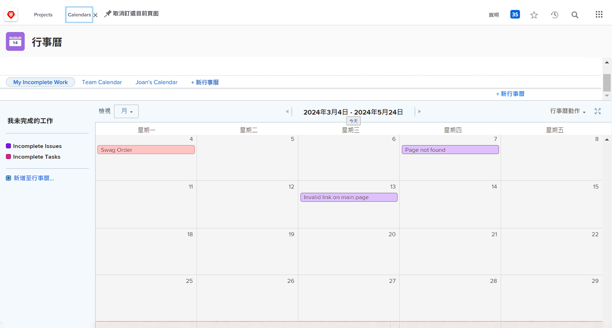

# 輪到您建立日曆

在此活動中，您將獲得建立自己日曆的體驗。

## 活動：建立日曆

建立名為「我未完成的工作」的客戶日曆。

包括名為「未完成任務」的日曆組，顯示當前項目上分配給您的所有未完成任務。

選取紅色作為這些項目的顏色。

包括另一個名為「未完成問題」的日曆組，顯示當前項目上分配給您的所有未完成問題。 選取藍色作為這些項目的顏色。

## 回答

1. 從「主」菜單導航到「日曆」區域。
1. 按一下「新建日曆」按鈕，將日曆命名為「我未完成的工作」。
1. 在第一個分組下，按一下「新增進階項目」 。
1. 在彈出的「將項添加到日曆」窗口中，將組命名為「未完成任務」。
1. 選擇紅色作為顏色。
1. 將「日期」欄位更改為「計畫日期」。
1. 在日曆上，將「顯示」欄位設定為「僅結束日期」。
1. 將「可用時切換為實際日期」欄位設定為「否」。

   

1. 在「要添加到日曆中的內容」中， 部分，選擇任務。
1. 新增三個篩選規則：

   * 項目>狀態等於>等於>當前
   * 分配用戶> ID >相等> $$USER.ID
   * 任務>完成>等於>假

1. 按一下「儲存」 。

   

1. 按一下「新增至日曆」以建立第二個分組。
1. 在此分組下，按一下「添加高級項」。
1. 在彈出的「將項目新增至日曆」視窗中，將群組命名為「未完成的問題」。
1. 選取藍色作為顏色。
1. 將「日期」欄位更改為「計畫日期」。
1. 在日曆上，將「顯示」欄位設定為「僅結束日期」。
1. 將「可用時切換為實際日期」欄位設定為「否」。
1. 在「要添加到日曆中的內容」中， 區段中，選擇「問題」。
1. 新增下列三個篩選規則：

   * 項目>狀態等於>等於>當前
   * 分配用戶> ID >相等> $$USER.ID
   * 問題>完整>等於>假

1. 按一下「儲存」 。

   

由於您在篩選器中使用$$USER.ID，因此您可以與其他人共用此日曆，他們將看到自己不完整的任務和問題。
