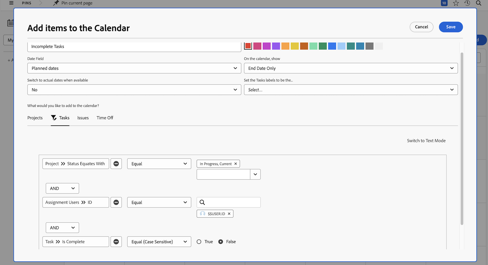

# 輪到您建立行事曆報告

在此活動中，您將可以親自動手建立自己的行事曆。

## 活動：建立行事曆

建立名為「我的未完成工作」的客戶行事曆。

包含一個名為「未完成任務」的行事曆群組，顯示目前專案中指派給您的所有未完成任務。

選取紅色作為這些項目的顏色。

包含另一個名為「未完成問題」的行事曆群組，顯示目前專案中指派給您的所有未完成問題。選取藍色作為這些項目的顏色。

## 解答

1. 導覽到主選單的「行事曆」區域
1. 按一下「新增行事曆」按鈕並把行事曆命名為「我的未完成工作」。
1. 按一下「新增至行事曆」按鈕，然後按一下「新增進階專案」。
1. 在「新增項目至行事曆」快顯視窗中，把群組命名為「未完成任務」。
1. 選取紅色作為顏色。
1. 將「日期欄位」變更為「規劃日期」。
1. 將「在行事曆上顯示」欄位設為「只有結束日期」。
1. 將「可用時切換至實際日期」欄位設為「否」。
1. 在「您希望向行事曆新增甚麽？」區段，選取工作。 然後按一下「新增工作」按鈕。
1. 新增三個篩選規則：

   * 「專案」>「狀態等同於」>「等於」>「目前」
   * 「指派使用者」>「ID」>「等於」>「$$USER.ID」
   * 「任務」>「已完成」>「等於」>「False」

1. 按一下「儲存」。

   

1. 按一下新增至行事曆，然後按一下新增進階專案，以建立第二個群組。
1. 在「新增項目至行事曆」快顯視窗中，把群組命名為「未完成問題」。
1. 選取藍色作為顏色。
1. 將「日期欄位」變更為「規劃日期」。
1. 將「在行事曆上顯示」欄位設為「只有結束日期」。
1. 將「可用時切換至實際日期」欄位設為「否」。
1. 在「您希望向行事曆新增甚麽？」區段，選取問題。 然後按一下「新增問題」按鈕。
1. 新增以下三個篩選規則：

   * 「專案」>「狀態等同於」>「等於」>「目前」
   * 「指派使用者」>「ID」>「等於」>「$$USER.ID」
   * 「問題」>「已完成」>「等於」>「False」

1. 按一下「儲存」。

   

由於您在篩選器中使用 $$USER.ID，所以可以與其他人共用這個行事曆，他們將看到自己的未完成任務和問題。
