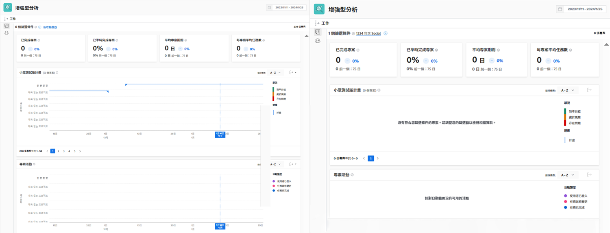

# 瞭解中的KPI [!UICONTROL 增強型分析]

在本影片中，您將瞭解：

* 如何從KPI資料取得價值

>[!VIDEO](https://video.tv.adobe.com/v/335046/?quality=12&learn=on)

## 比較KPI

KPI不僅針對目前所發生的情況提供寶貴資訊，也讓使用者能夠比較活動在一段時間內的變化，或比較專案組合、計畫、專案所有者或任何其他使用的篩選器之間的差異。

例如，您可以在兩個瀏覽器標籤中調出分析資料，以比較KPI。
