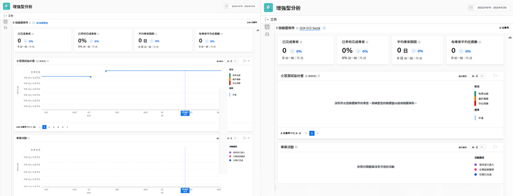

# 了解 KPI

觀看這段影片，您將會了解：

* 如何從 KPI 資料中獲取價值

>[!VIDEO](https://video.tv.adobe.com/v/335046/?quality=12&learn=on&enablevpops=1)

## 比較 KPI

KPI 不但能針對現在的情況提供重要的資訊，也讓使用者能夠比較一段時間內活動發生的變更，或是專案組合、方案、專案所有者或所使用的任何其他篩選器之間的差異。

例如，您可以把兩個瀏覽器分頁的分析提取出來進行 KPI 比較。
