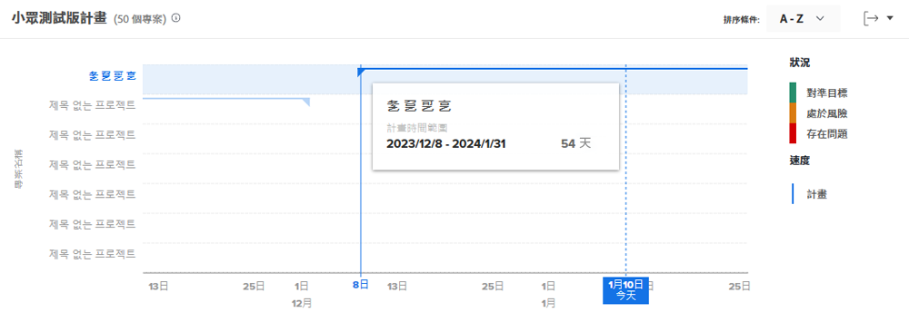
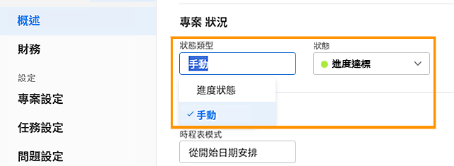

# 瞭解如何導覽和檢閱專案

觀看這段影片，您將會瞭解：

* 如何閱讀飛行計劃圖

>[!VIDEO](https://video.tv.adobe.com/v/335047/?quality=12&learn=on)

## 飛行計劃圖

在圖表上，您會看到：

1. 專案名稱位在左側。
1. 日期顯示在底部。
1. 垂直的藍線顯示滑鼠游標懸停之處的特定日期。
1. 水平的藍線顯示專案的規劃開始日期和結束日期。
1. 綠線表示該專案「進展順利」。
1. 橘線表示該專案「有風險」。
1. 紅線表示該專案「存在問題」。

查看這些專案相關資訊可協助您確認：

* 哪些事件使專案超出規劃完成日期。
* 專案在什麼時候開始發生問題。
* 同一時段內有多少個專案處於未完成狀態。
* 有多少專案是進行中。
* 哪些專案需要額外注意或支援。

## 狀況以進度狀態為準

專案狀況是用視覺化方式呈現的專案進展情況。Workfront 根據專案內任務的進度狀態確認狀況。

您可以用下列方式設定專案的狀況：

* **手動**，由具有管理專案權限的使用者，在專案狀況類型設為「手動」時使用。您可以藉此獨立設定專案的狀況，不受關鍵路徑影響。
* **自動**，由 Workfront 在專案的狀況類型設定為「進度狀態」時使用。

Workfront 建議您將狀況類型設為「進度狀態」，以便根據任務的進度清楚瞭解專案的真實進度。

當設定為「進度狀態」時，專案狀況可能如下：

* **進展順利** — 當關鍵路徑上最後一項任務的進度狀態為「進展順利」時，專案的狀況便是「進展順利」。該專案有望如期完成。
* **有風險** — 當關鍵路徑上最後一個任務的進度狀態為「落後」或「有風險」時，專案的狀況便是「有風險」。該專案預計會延遲完成，但目前尚未延遲。
* **存在問題** — 當關鍵路徑上最後一個任務的進度狀態為「延遲」時，則專案的狀況是「存在問題」。截止日期已經過去，專案進度目前已延遲。

>[!NOTE]
>
>您可以根據環境自訂專案狀況，所以您可能發現超過三個選項，或是其名稱可能與上述名稱不同。關於自訂狀況的資訊，請參閱文章「[建立或編輯自訂狀況](https://experienceleague.adobe.com/docs/workfront/using/administration-and-setup/customize/custom-conditions/create-edit-custom-conditions.html?lang=zh-Hant)」。
