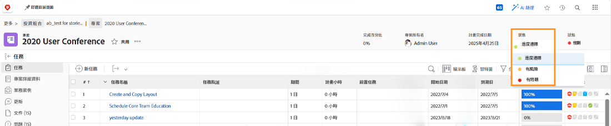

# 瞭解在中導覽和檢閱專案 [!UICONTROL 增強型分析]

在本影片中，您將瞭解：

* 如何閱讀小眾測試版計畫圖

>[!VIDEO](https://video.tv.adobe.com/v/335047/?quality=12&learn=on)

## 小眾測試版計畫圖

在圖表上，您會看到：

1. 專案名稱在左側。
1. 日期會顯示在底部。
1. 垂直藍線顯示滑鼠停留在滑鼠上的特定日期。
1. 水準藍線顯示專案的計劃開始和結束日期。
1. 綠色線條表示專案符合目標。
1. 橘色線表示專案有風險。
1. 紅線表示專案存在問題。

檢視這些專案的相關資訊可協助您判斷：

* 哪些事件會使專案延長超過計畫的完成日期。
* 當專案開始遇到問題時。
* 相同期間內開啟的專案數目。
* 使用中的專案數目。
* 哪些專案需要額外的注意或支援。

## 條件是以進度狀態為基礎

專案狀態是專案進度方式的視覺化表示。 Workfront會根據專案中任務的進度狀態來判斷條件。

專案的條件可以設定：

* **手動**，當專案的條件型別設定為手動時，可由有權管理專案的使用者執行。 這可讓您設定獨立於關鍵路徑的專案條件。
* **自動**，由Workfront提供，專案的條件型別設為「進度狀態」。

Workfront建議您將條件型別設定為「進度狀態」，以便根據任務的進度，清楚指示專案的真正進度。

若設為「進度狀態」，專案條件可以是：

* **準時** — 當關鍵路徑上最後一個任務的進度狀態為「準時」時，專案的條件將為「準時」。 專案有望如期完成。
* **有風險** — 當關鍵路徑上最後一個任務的進度狀態為「落後」或「有風險」時，則專案的狀況為「有風險」。 專案有望延遲完成，但尚未延遲。
* **陷入困境** — 當關鍵路徑上最後一個任務的進度狀態為「延遲」時，則專案狀況為「存在問題」。 到期日已過，專案現在延遲。

>[!NOTE]
>
>條件可以根據您的環境自訂，因此您可能會找到三個以上的選項，或者名稱可能與上述選項不同。 如需自訂條件的詳細資訊，請參閱文章 [建立或編輯自訂條件](https://experienceleague.adobe.com/docs/workfront/using/administration-and-setup/customize/custom-conditions/create-edit-custom-conditions.html?lang=en).
