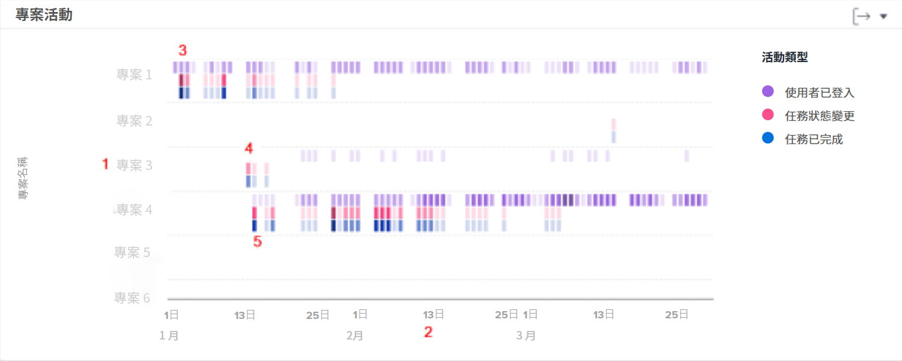

# 了解如何導覽和檢閱專案活動

觀看這段影片，您將會了解：

* 了解如何根據已登入的使用者、任務狀態變更和已完成的任務來進行專案比較

>[!VIDEO](https://video.tv.adobe.com/v/335049/?quality=12&learn=on)

## 比較專案工作

您可以利用專案活動表來了解各種專案活動，包括已登入的使用者、任務狀態變更以及已完成的任務，並針對 Workfront 中其他專案進行這些活動的比較。專案活動用不同顏色顯示以便總結一段時間內的活動情況。

查看這些資訊可協助您判斷：

* 特定專案的活動。
* 比較一個專案與另一個專案的活動。
* 哪些使用者正在處理項目以及頻率如何。

在圖表上，您可以看到：

1. 專案名稱位在左側。
1. 日期顯示在底部。
1. 紫色方塊顯示指派至專案的使用者在那一天曾登入，而顏色較深則表示登入的使用者人數較多。
1. 粉紅方塊表示使用者在那一天變更專案任務的狀態，而顏色較深表示任務狀態變更的次數較多。
1. 藍色方塊表示使用者已完成專案的一項任務，而顏色較深表示已完成的任務數量較多。
