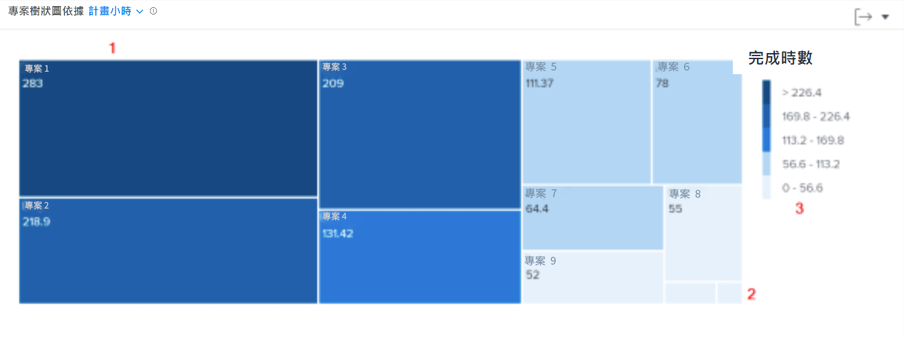

# 深入瞭解中的導覽 [!UICONTROL 增強型分析]

在本影片中，您將瞭解：

* 如何快速瞭解工作者投入每個專案的時間

>[!VIDEO](https://video.tv.adobe.com/v/335050/?quality=12&learn=on)

## 檢閱專案逗留時間

專案樹狀圖可讓您瞭解使用者在專案上花費了多少時間。 方塊代表專案。 方塊的大小顯示相較於其他專案，專案上所花費的時間。 方塊愈大，逗留的時間愈多。

檢視此資訊可協助您判斷：

* 所選日期範圍內正在處理的專案的優先順序。
* 使用者正在將時間花在哪些上。
* 如果使用者聚焦於正確的事。
* 選取特定專案時，專案範圍在該時段內的變更程度。

在圖表上，您可以看到：

1. 在篩選過的時間內完成小時數較多的專案會以較大的方塊和深藍色表示。
1. 在篩選時間內，完成時數較少的專案會以較小的方塊和淺藍色表示。
1. 圖表右側的圖例顯示每個藍色陰影的完成時數範圍。
