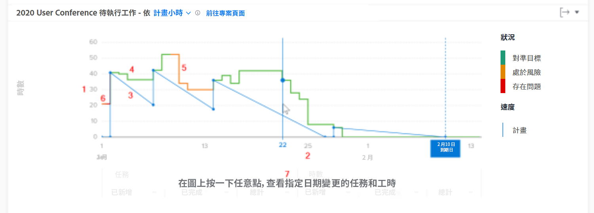

# 了解存取和檢閱燃盡圖

觀看這段影片，您將會了解：

* 如何存取燃盡圖
* 如何理解專案的剩餘時間、專案狀況和速度之間的關係

>[!VIDEO](https://video.tv.adobe.com/v/3438895/?quality=12&learn=on&enablevpops&captions=chi_hant)

## 追蹤專案速度

您可以藉由燃盡圖理解剩餘時間、專案狀況和速度之間的關係。實線表示專案在一段時間內花費的時數，以及專案每天的狀況。虛線表示從開始日期到規劃完成日期的規劃速度，會隨著任務日期變更進行調整。

查看這些資訊可協助您判斷：

* 出現的問題 (未規劃的工作) 如何影響規劃的工作。
* 哪些事件使您的專案超出規劃完成日期。

在圖表上，您可以看到：

1. 時數位在左邊。
1. 日期顯示在底部，包括專案的規劃完成日期 (如果此日期位於所選日期範圍內)。
1. 藍色實線顯示專案的速度 (規劃時數或一段時間內的期間)，當到達專案的規劃完成日期時，會變垂直虛線。
1. 綠線表示專案狀況「進展順利」。
1. 橘線表示專案狀況是「有風險」。
1. 紅線表示專案狀況是「存在問題」。
1. 當您按一下圖表上的特定一點，關於任務和時數 (總時數、增加的數量以及完成的數量) 在特定日子的資訊會顯示在 X 軸下方。
