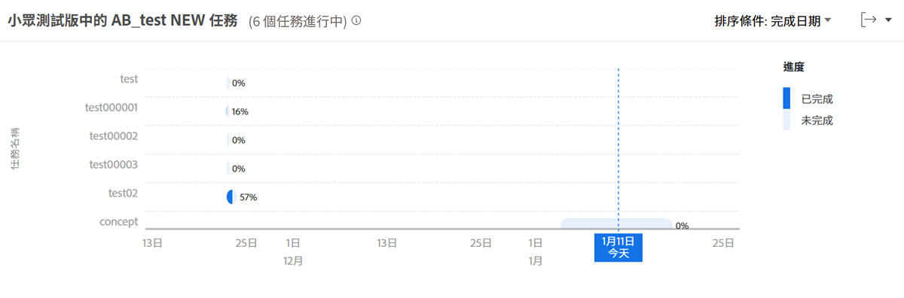

# 在中查看飛行任務 [!UICONTROL 增強的Analytics]

在此影片中，您將學習：

* 如何訪問飛行圖中的任務
* 如何快速查看項目中尚未完成哪些任務

>[!VIDEO](https://video.tv.adobe.com/v/335052/?quality=12&learn=on)

## 任務級資料

「飛行中的任務」圖表允許您深入查看特定項目的任務，以查看每個活動任務的已完成工作量以及任務的排程方式。 圖表可讓您了解專案中需要完成的工作，以及這些工作的完成百分比。

此資訊可協助您判斷：

* 人們在做什麼。
* 哪些任務可能會使項目面臨風險。
* 任務完成的距離。
* 你需要跟誰談一談特定任務。

在圖表上，您可以看到：

1. 左邊的任務名稱。
1. 最後的日期。
1. 任務欄中的深藍色表示任務已完成的工作量。
1. 任務欄內的淺藍色表示任務需要完成的工作量。
1. 任務欄右側的數字顯示任務的完成百分比。
