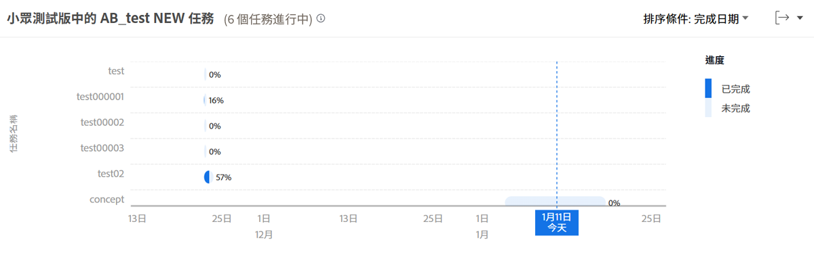

# 審閱飛行圖中的任務

觀看這段影片，您將會了解：

* 如何存取飛行圖中的任務
* 如何快速查看專案中有哪些任務尚未完成

>[!VIDEO](https://video.tv.adobe.com/v/335052/?quality=12&learn=on&enablevpops=1)

## 任務層級資料

您可以利用飛行圖中的任務深入探究特定專案的任務，查看每項進行中任務已完成的工作量，以及該任務是否符合排程的進度。 該圖表讓您了解專案中有哪些任務需要完成，以及這些任務的完成百分比是多少。

此資訊可協助您確定：

* 人們正在做什麼。
* 哪些任務可能會使專案面臨風險。
* 任務距離完成有多近。
* 您需要與誰討論特定任務。

在圖表上，您可以看到：

1. 任務名稱在左側。
1. 日期在底部。
1. 任務列的深藍色表示任務的已完成工作量
1. 任務列中的淺藍色表示任務的待完成工作量。
1. 任務欄側右側的數字顯示任務的完成百分比。
