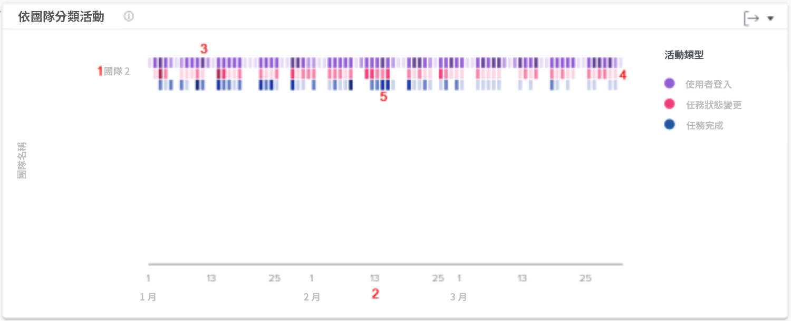

# 了解「依團隊檢視活動」圖表

您可以利用「團隊活動」圖表了解組織的主團隊在 Workfront 中如何使用時間。Workfront 使用者可以屬於多個團隊，但是他們只能參與一個主團隊。「人員」圖表中使用的團隊，僅包含把該團隊指定為主團隊的使用者。

以不同顏色顯示各種活動 (使用者登入、任務狀態變更和任務已完成)，總結篩選時段內發生的這些事件。

查看這些資訊可協助您判斷：

* 主團隊中正進行哪些活動以及進展速度如何。
* 哪一個主團隊工作過度或是使用系統比較多。
* 對於主團隊的工作分配是否適當。

在圖表上，您可以看到：

1. 主團隊名稱位於左側。
1. 底部的日期取自所選日期範圍。
1. 紫色方塊顯示指派至專案的使用者在那一天曾登入，而顏色較深則表示登入的使用者人數較多。
1. 粉紅方塊表示使用者在那一天變更專案任務的狀態，而顏色較深表示任務狀態變更的次數較多。
1. 藍色方塊表示使用者已完成專案的一項任務，而顏色較深表示已完成的任務數量較多。

## 如何導覽到圖表

1. 按一下左側面板上的「[!UICONTROL 人員]」標籤。
1. 使用「[!UICONTROL 篩選]」選擇一個或更多主團隊進行檢查。
1. 您將看團隊活動圖表顯示在人員圖表頂端。
