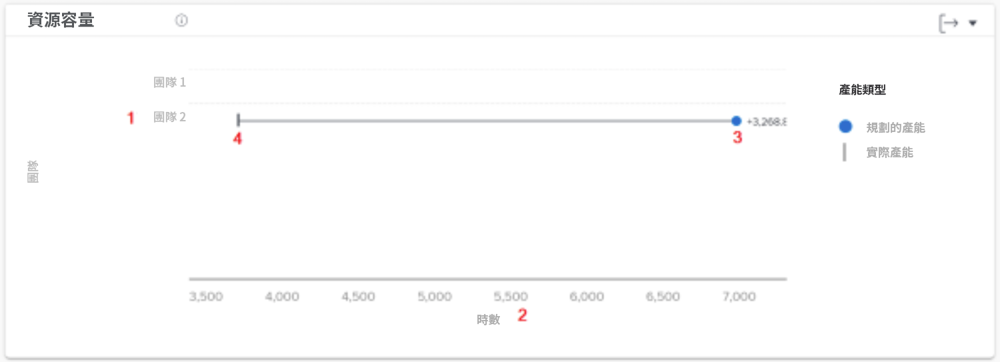
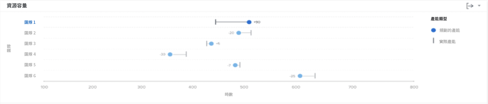

# 了解中的資源容量圖 [!UICONTROL 增強的Analytics]

「資源能力」圖表顯示在篩選的時段內分配給主團隊的計畫小時數，與該團隊的總可用小時數相比。

這種比較有助於您判斷，您是否沒有為團隊分配足夠的工作，或他們是否可能因繁重的工作量而筋疲力盡。 按一下團隊名稱，然後出現「團隊能力」圖表，顯示有關已篩選時段內團隊能力的詳細資訊。

查看此資訊有助於您確定：

* 如果主團隊被過度分配或分配不足。
* 哪些主隊可以工作。

在圖表上，您可以看到下列主要詳細資訊：

1. 主隊名在左邊。
1. 時數在最下方。 這是圖表的x軸，會計算至上方團隊中顯示的小時數範圍。
1. 圓圈顯示分配給主團隊的計畫小時數。
1. 垂直線顯示主團隊可用的總小時數。

## 如何使用圖表

您必須新增篩選條件並選取日期範圍，以在 [!UICONTROL 增強的分析功能] Workfront地區。 如果您先前新增了篩選器，則這些篩選器會處於作用中狀態，直到您移除為止。

在「資源能力」圖表上，您可以：

* 將滑鼠指標暫留在主團隊線上，查看仍可排程的小時數、主團隊要完成的計畫小時數，以及工作總小時數（標示為「超過」、「不足」或「容量」）。
* 使用圖表右上角的匯出按鈕匯出圖表資料。
* 按一下主團隊名稱以開啟「團隊容量」圖表。 在「團隊能力」圖表上放大到較小的時間範圍，會更新「資源能力」圖表上顯示的資料。
