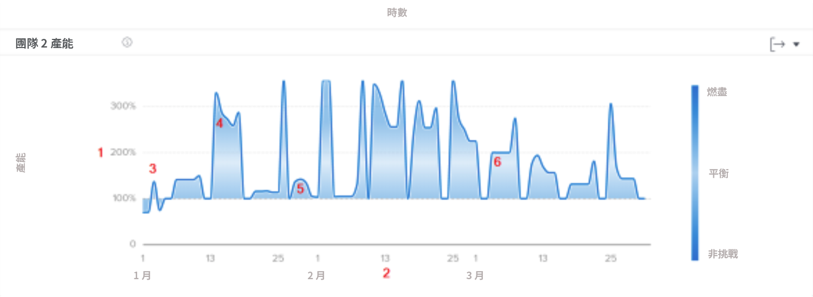
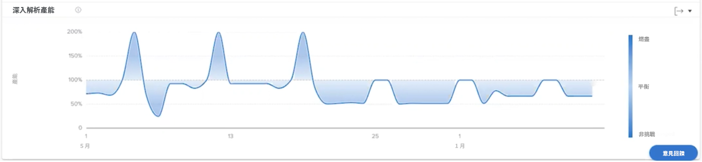

# 瞭解團隊容量

「團隊容量」圖表顯示主團隊何時分配過多或分配不足。 此圖表顯示指定日期指派給主團隊的工作量，並在主團隊接近待執行工作或未受到挑戰時，指派較暗的藍色。 較淺、較透明的顏色表示工作負載較平衡。

檢視此資訊可協助您判斷：

* 主團隊配置過多或配置不足時。
* 如果主團隊每天都分配過多或分配不足。
* 主團隊的工作負荷每天的一致程度。
* 如果您在新工作中遇到容量問題。

在圖表上，您可以看到：

1. 主團隊容量的百分比在左側。
1. 底部的日期來自選取的日期範圍。
1. 較深的藍色填色表示主團隊正在經歷倦怠期(4)或未被挑戰。
1. 較淺或較透明的藍色表示主團隊的工作量已平衡

## 如何導覽至圖表

1. 按一下 [!UICONTROL 人員] 標籤。
1. 使用 [!UICONTROL 篩選] 選擇要檢查的一或多個Home團隊。
1. 您會看到團隊容量圖表顯示在下方 [!UICONTROL 資源容量] 圖表。

## 如何使用圖表

若要在Analytics區域「人物」區段的圖表上顯示資料，您必須新增篩選器並選取日期範圍。 如果您之前已新增篩選器，則這些篩選器會在您移除之前處於活動狀態。

在「團隊容量」圖表上，您可以：

* 將滑鼠停留在圖表上的某個點上可檢視日期線。
* 將滑鼠停留在圖示生產線上的某個點，可檢視指定日期的排程時數與計畫時數、產能百分比，以及主團隊目前是超出、不足或處於產能。
* 在專案的特定點上按一下滑鼠並拖曳滑鼠，以放大日期。 （此動作會更新所有其他圖表，放大顯示相同的日期範圍。）
* 使用圖表右上角的匯出按鈕匯出圖表資料。
