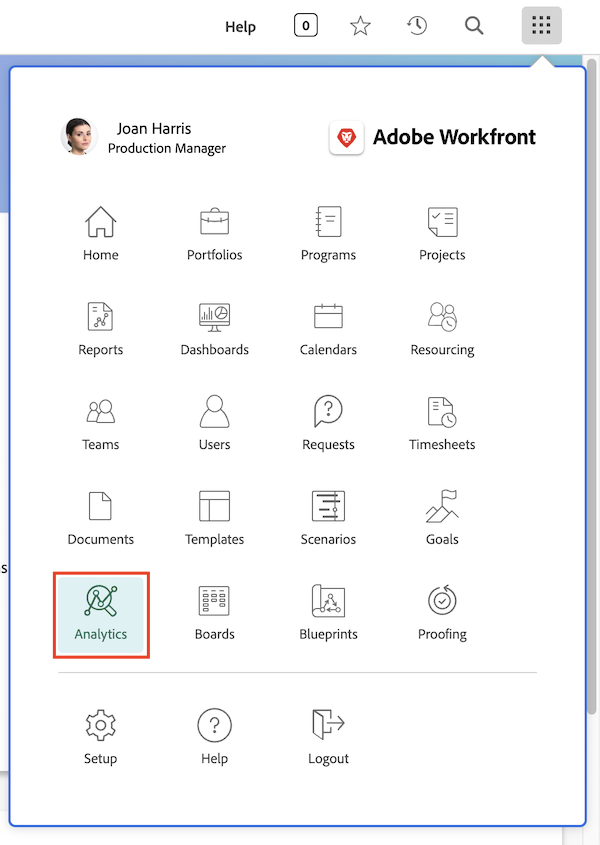

# 如何存取增強型分析

與 Workfront 的大多數其他功能一樣，您可以從主選單存取[!UICONTROL 增強型分析]。但[!UICONTROL 分析]預設不在主選單上。

如果沒有出現在主選單，則您的系統或群組管理員必須為您新增。他們將在版面配置範本中執行此操作。下面的影片說明如何操作。

## 新增分析到版本配置範本

在本影片中，您將了解系統和群組管理員如何授予對 Workfront 中的[!UICONTROL 分析]存取權。

>[!VIDEO](https://video.tv.adobe.com/v/335045/?quality=12&learn=on)

只要「[!UICONTROL 分析]」已經新增到所指派的版面範本，則任何具有 Workfront 授權 ([!UICONTROL Workfront Business] 計劃中的「工作」、「計劃」或「協作者」或更高) 的人皆可存取。但是，唯有您的 Workfront 存取層級以及特定專案和使用者的共用權限允許的情況下，您才會看到那些專案和使用者資訊。
