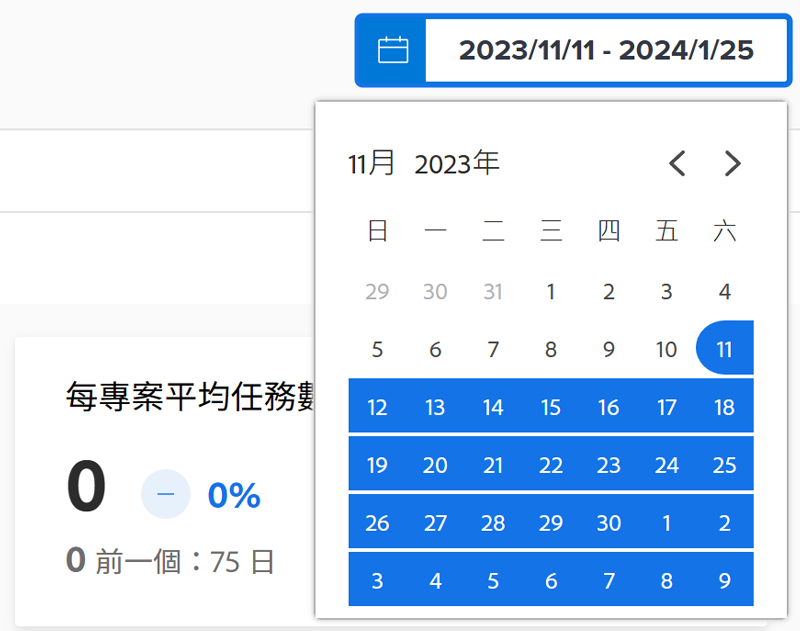
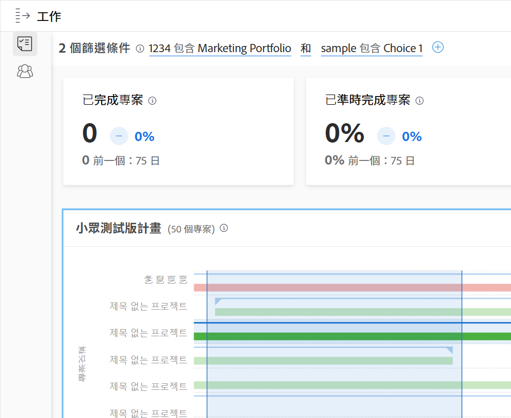

# 了解日期範圍和時間範圍

在檢視[!DNL Enhanced analytics]圖表時，我們使用行事曆 widget 來指定日期範圍。當您按一下並拖曳來定義特定區域時，便會在圖表中建立時間範圍，因此您可以放大顯示，仔細查看該時間範圍內的資訊。

## 日期範圍

按一下行事曆中任何日期，表示您的範圍內的一個日期，再按一下任何日期，表示範圍的另一端。如果您的開始日期和結束日期不在同一個月份，請使用行事曆上方的箭頭導覽到不同的月份。

在[!DNL Analytics]中的圖示依預設顯示過去 60 天和未來 15 天的資料。您可以選取新的日期範圍並在使用 [!DNL Analytics] 時，套用到全部圖表。

當您重新整理頁面、導覽到其他地方，或登出/登入 Workfront 時，日期範圍將重設為預設值。

## 時間範圍

按一下並在所需的時間表區段附近拖曳來建立時間範圍篩選器。此時間範圍現在適用於工作區域中的所有圖表，而且其顯示在篩選器列中任何其他篩選器的旁邊。按一下並在區域附近拖曳可更新時間範圍，藉此更深入查看圖表。要刪除時間範圍篩選器，只需在篩選器列中將滑鼠游標懸停在該時間範圍上方，然後按一下所出現的 X。

當您重新整理頁面、導覽至其他地方，或登出 Workfront 時，系統便會刪除時間範圍並重設日期範圍。

>[!NOTE]
>
>專案樹狀圖無法使用這個時間範圍選項。
