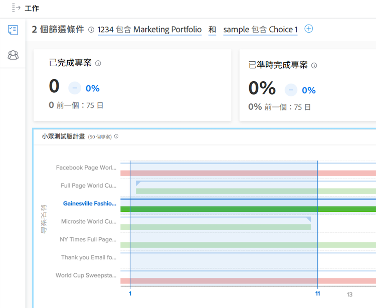

# 瞭解中的日期範圍和時間範圍 [!UICONTROL 增強型分析]

檢視 [!DNL Enhanced analytics] 使用行事曆Widget指定圖表、日期範圍。 當您按一下並拖曳以定義特定區域時，時間範圍就會在圖表中建立，因此您可以放大並更詳細地檢視該時間範圍內的資訊。

## 日期範圍

只要按一下行事曆中的任何日期，指出範圍中的某個日期，然後按一下任何日期，指出範圍的另一個結尾。 如果您的開始和結束日期不在同一個月內，請使用日曆頂端的箭頭，導覽至不同的月份。

中的圖表 [!DNL Analytics] 依預設會顯示過去60天和未來15天的資料。 您可以選取新的日期範圍，並在使用時將它套用至所有圖表 [!DNL Analytics].

當您重新整理頁面、離開或登出/登入Workfront時，日期範圍會重設為預設值。

## 時間範圍

按一下並拖曳時間軸的所需區段，以建立時間範圍篩選器。 此時間範圍現在套用至工作區域中的所有圖表，並顯示在篩選列中的任何其他篩選器旁邊。 按一下並拖曳區域以更新時間範圍，深入瞭解圖表。 若要移除時間範圍篩選器，只需將滑鼠游標停留在篩選器列中的時間範圍上方，然後按一下顯示的X即可。

當您重新整理頁面、離開或登出Workfront時，時間範圍會遭到移除，日期範圍也會重設。

>[!NOTE]
>
>您無法將此時間範圍選項用於「專案樹狀圖」和「資源容量」圖表。
