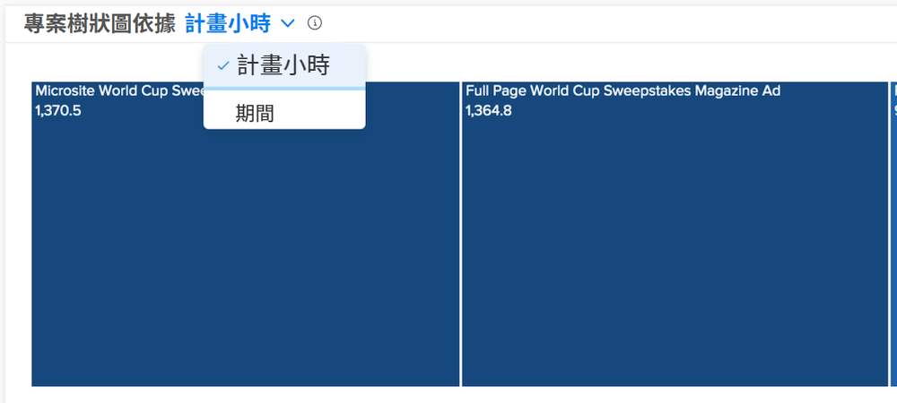

# 了解規劃時數和期間視圖

在燃盡圖和專案樹狀圖表中，根據您認為對 Workfront 環境而言比較準確的項目，依規劃時數或期間檢視資訊。

規劃時數是預設值。如果您切換到期間，當您離開 [!DNL Analytics] 然後再回來，以及在 Workfront 登入登出之間，都會維持這個設定。

## 方塊大小與顏色深淺是代表什麼意義？

小型的淺藍方塊表示時數較少，而大型的深藍方塊表示時數較多。如需更多資訊，請參閱「[了解專案樹狀圖視覺化](https://experienceleague.adobe.com/docs/workfront/using/reporting/enhanced-analytics/project-treemap-overview.html?lang=zh-Hant)」。
