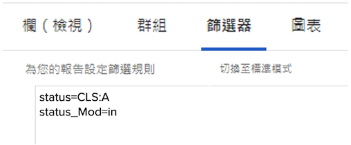

# 了解篩選器的基本文字模式

>[!IMPORTANT]
>
>必要條件：
>
>* 了解報表元素
>* 了解報表元件
>* 建立基本篩選


在此影片中，您將學習：

* 什麼是文字模式
* 駝峰是什麼
* 您可以在報表篩選器中使用一些基本的「即插即用」文字模式

>[!VIDEO](https://video.tv.adobe.com/v/336820/?quality=12)

以下文本模式將排除用戶已標籤為「完成我的部件」的任務。 您只需建立任務篩選器，添加任何需要的篩選規則，然後切換到文本模式，並將代碼貼到您在篩選器中看到的任何文本模式之後。

```
EXISTS:1:$$OBJCODE=ASSGN  
EXISTS:1:taskID=FIELD:ID  
EXISTS:1:status=DN  
EXISTS:1:status_Mod=notin  
EXISTS:1:assignedToID=$$USER.ID 
```

## 其他即插即用文本模式篩選器

### 任務 — 顯示等待我批准的所有任務

```
approvalProcessID_Mod=notblank
currentUserApproversMM:ID=$$USER.ID
currentUserApproversMM:ID_Mod=in
currentUserApproversMM_Join=allowingnull
```

### 任務 — 顯示我批准的所有任務

使用您想要的任何篩選器建立任務報告，然後轉到「篩選器」頁簽，按一下「切換到文本模式」。 將此程式碼新增至已存在的項目：

```
approvalProcessID_Mod=notblank
approverStatuses:approvedByID=$$USER.ID
approverStatuses:approvedByID_Mod=in
```

### 任務 — 顯示至少有一個跨項目前置任務的所有任務

```
predecessorsMM:ID_Mod=notblank
predecessorsMM:projectID=FIELD:projectID
predecessorsMM:projectID_Mod=ne
```

### 任務 — 顯示我分配給其他任務的所有任務

使用您想要的任何篩選器建立任務報告，然後轉到「篩選器」頁簽，按一下「切換到文本模式」。 將此程式碼新增至已存在的項目：

```
EXISTS:1:$$OBJCODE=ASSGN
EXISTS:1:taskID=FIELD:ID
EXISTS:1:assignedByID=$$USER.ID
```

這將顯示登入的使用者指派至少一個目前受指派者的所有工作。 如果受分配者被多個人指派，則只有指派某人的第一個人員的名稱，在任務登陸頁面上會顯示為「請求者」。

## 活動：文字模式問題

1. 您如何為標題為「由ID輸入」的欄位撰寫駝峰大小寫？
1. 在「問題」報表中，建立篩選器以顯示標示為已結束但待核准的問題。

### 答案

1. 「Entered By ID」欄位的駝峰大小寫應如下 — enteredByID
1. 文字模式在問題報表篩選器中應如下所示：

   
