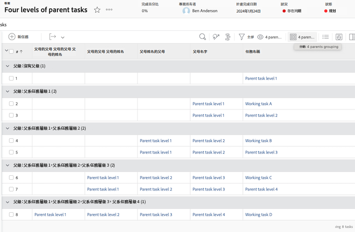
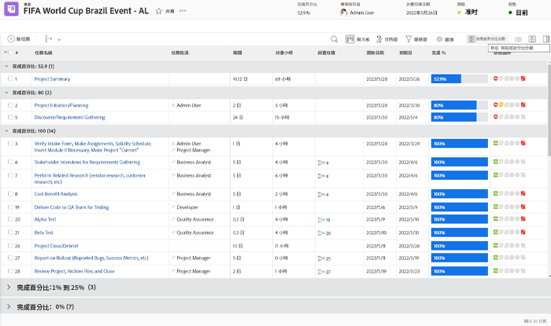
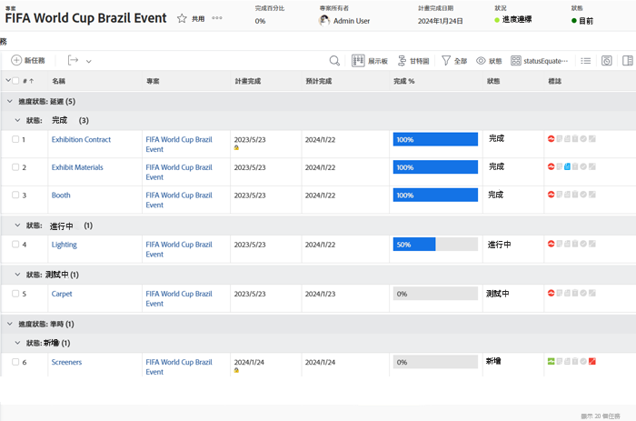
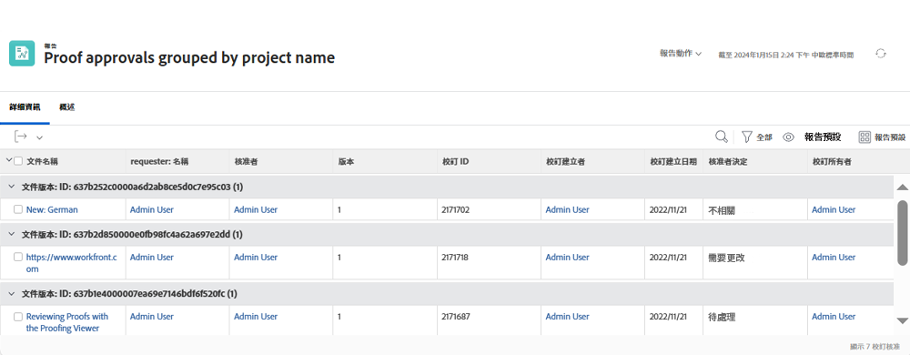
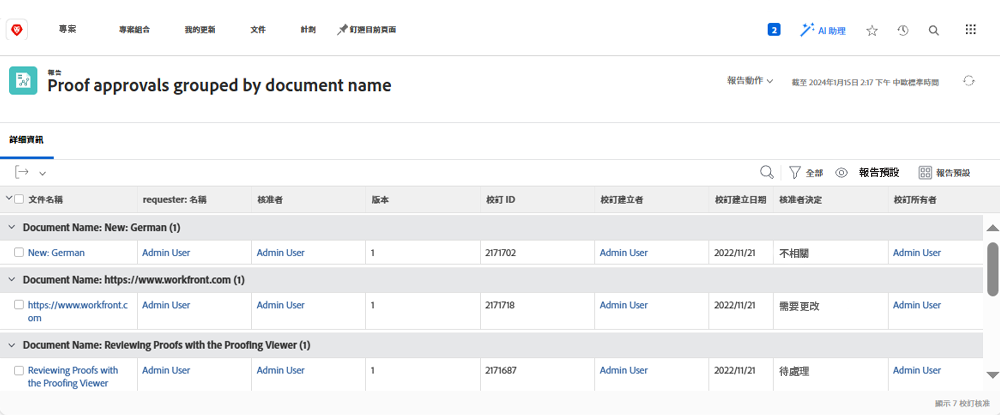

# 瞭解群組的基本文字模式

>[!IMPORTANT]
>
>先決條件：
>
>* 瞭解報表元素
>* 瞭解報表元件
>* 建立基本分組


>[!TIP]
>
>* 若要更深入地瞭解文字模式，我們建議您觀看錄製的網路研討會活動 [詢問專家 — 文字模式報告簡介](https://experienceleague.adobe.com/docs/workfront-events/events/reporting-and-dashboards/introduction-to-text-mode-reporting.html?lang=en)，長度為一小時。
>* 若要進一步瞭解文字模式，建議您觀看 [進階報告](https://experienceleague.adobe.com/docs/workfront-learn/tutorials-workfront/reporting/advanced-reporting/welcome-to-advanced-reporting.html?lang=en) 教學課程，總共有五個半小時的長度。


在本影片中，您將瞭解：

* 什麼是文字模式
* 什麼是駝峰式大小寫
* 您可以用於分組的一些基本「隨插即用」文字模式

>[!VIDEO](https://video.tv.adobe.com/v/3410641/?quality=12&learn=on)

## 任務 — 4個父項群組

下列文字模式將依據最多四個層級的父項來分組任務，並將不存在的父項留白。

```
textmode=true
group.0.name=Parents
group.0.valueexpression=CONCAT({parent}.{parent}.{parent}.{parent}.{name},IF(ISBLANK({parent}.{parent}.{parent}.{parent}.{name}),"",", "),{parent}.{parent}.{parent}.{name},IF(ISBLANK({parent}.{parent}.{parent}.{name}),"",", "),{parent}.{parent}.{name},IF(ISBLANK({parent}.{parent}.{name}),"",", "),IF(ISBLANK({parent}.{name}),"No parent",{parent}.{name}))
group.0.linkedname=parent
group.0.namekeyargkey.0=parent
group.0.namekeyargkey.1=name
group.0.valueformat=string
```




## 任務 — 完成百分比分組

下列文字模式會根據任務的完成百分比來分組任務。 任務在分組時將屬於以下類別之一：

* 0%
* 1%至25%
* 26%至50%
* 51%至75%
* 76%至99%
* 100%

```
group.0.linkedname=direct
group.0.namekey=percentComplete
group.0.valueexpression=IF({percentComplete}<1,"0%",IF({percentComplete}<26,"1% to 25%",IF({percentComplete}<51,"26% to 50%",IF({percentComplete}<76,"51% to 75%",IF({percentComplete}<100,"76% to 99%",IF({percentComplete}=100,"100","***"))))))
group.0.valueformat=doubleAsString
textmode=true
```



## 任務 — statusEquatesWith，然後按status

下列文字模式將依statusEquatesWith，然後依狀態來分組工作。

```
group.0.enumclass=com.attask.common.constants.TaskStatusEnum
group.0.enumtype=TASK
group.0.linkedname=direct
group.0.name=State
group.0.type=enum
group.0.valuefield=statusEquatesWith
group.0.valueformat=val
group.1.enumclass=com.attask.common.constants.TaskStatusEnum
group.1.enumtype=TASK
group.1.linkedname=direct
group.1.namekey=status
group.1.type=enum
group.1.valuefield=status
group.1.valueformat=val
textmode=true
```




## 校訂核准 — 依專案名稱分組

```
group.0.valueformat=HTML
group.0.valuefield=documentVersion:document:project:name
group.0.displayname=Project Name
```




## 校訂核准 — 按檔名稱分組

```
group.0.displayname=Document Name
group.0.valuefield=documentVersion:document:name
group.0.valueformat=HTML
```



