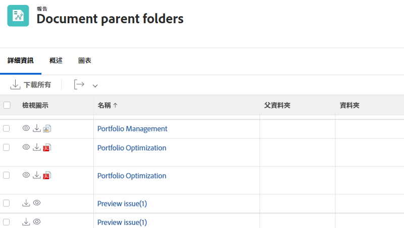

# 瞭解視圖的基本文字模式


>[!IMPORTANT]
>
>先決條件:
>
>* [瞭解報告元素](https://experienceleague.adobe.com/docs/workfront-learn/tutorials-workfront/reporting/basic-reporting/reporting-elements.html?lang=zh-Hant)
>* [瞭解報告元件](https://experienceleague.adobe.com/docs/workfront-learn/tutorials-workfront/reporting/basic-reporting/reporting-components.html?lang=zh-Hant)
>* [建立基本視圖](https://experienceleague.adobe.com/docs/workfront-learn/tutorials-workfront/reporting/basic-reporting/create-a-basic-view.html?lang=zh-Hant)

>[!TIP]
>
>* 為了深入瞭解文字模式，我們建議觀看錄影版網路研討會活動「[詢問專家 - 文字模式報告簡介](https://experienceleague.adobe.com/docs/workfront-events/events/reporting-and-dashboards/introduction-to-text-mode-reporting.html?lang=zh-Hant)」，影片長度為 1 小時。
>* 若要更加深入瞭解文字模式，我們建議觀看「[進階報告](https://experienceleague.adobe.com/docs/workfront-learn/tutorials-workfront/reporting/advanced-reporting/welcome-to-advanced-reporting.html?lang=zh-Hant)」教學課程，全部課程總長 5 個半小時。

觀看這段影片，您將會瞭解：

* 什麼是文字模式
* 什麼是駝峰式大小寫
* 可以在視圖中使用的一些基本「隨插即用」文字模式

>[!VIDEO](https://video.tv.adobe.com/v/3410571/?quality=12&learn=on)

## 任務 - 4 層父系視圖

先建立「任務名稱」欄及「父系名稱」欄，然後使用以下文字模式建立其他三欄。

### 任務 - 父系名稱之父系

```
displayname=Parent of Parent Name
linkedname=parent
namekey=view.relatedcolumn
namekeyargkey.0=parent
namekeyargkey.1=name
querysort=parent:parent:name
textmode=true
valuefield=parent:parent:name
valueformat=HTML
```

### 任務 - 父系名稱之父系之父系

```
displayname=Parent of Parent of Parent Name
linkedname=parent
namekey=view.relatedcolumn
namekeyargkey.0=parent
namekeyargkey.1=name
querysort=parent:parent:parent:name
textmode=true
valuefield=parent:parent:parent:name
valueformat=HTML
```

### 任務 - 父系名稱之父系之父系之父系

```
displayname=Parent of Parent of Parent of Parent Name
linkedname=parent
namekey=view.relatedcolumn
namekeyargkey.0=parent
namekeyargkey.1=name
querysort=parent:parent:parent:parent:name
textmode=true
valuefield=parent:parent:parent:parent:name
valueformat=HTML
```


## 使用者 - 在使用者視圖中顯示清單的疊代

### 使用者 - 所有職務角色

```
displayname=All job roles
listdelimiter=<p>
listmethod=nested(userRoles).lists
textmode=true
type=iterate
valuefield=role:name
valueformat=HTML
```

### 使用者 - 顯示主要角色的所有職務角色

```
displayname=All Job Roles showing primary
listdelimiter=<p> 
listmethod=nested(userRoles).lists 
textmode=true
type=iterate 
valueexpression=IF({user}.{roleID}={role}.{ID},CONCAT("** ",{role}.{name}," **"),{role}.{name})
valueformat=HTML
```

### 使用者 - 所有團隊

```
displayname=All teams
listdelimiter=<p>
listmethod=nested(teams).lists
textmode=true
type=iterate
valueexpression={name}
valueformat=HTML
```

>[!NOTE]
>
>有一個可以透過 UI 存取的「團隊」欄位，以逗號為區隔顯示所有團隊，但是使用上述文字模式會用單獨一行顯示每個團隊。


### 使用者 - 所有群組

```
displayname=All groups
listdelimiter=<p>
listmethod=nested(userGroups).lists
textmode=true
type=iterate
valuefield=group:name
valueformat=HTML
```

### 使用者 - 顯示主群組的所有群組

```
displayname=All groups showing home group
listdelimiter=<p>
listmethod=nested(userGroups).lists
textmode=true
type=iterate
valueexpression=IF({user}.{homeGroupID}={group}.{ID},CONCAT("** ",{group}.{name}," **"),{group}.{name})
valueformat=HTML
```


### 使用者 - 直屬部下

```
displayname=Direct reports
listdelimiter=<p>
listmethod=nested(directReports).lists
textmode=true
type=iterate
valueexpression={name}
valueformat=HTML
```

### 使用者 - 未來 PTO

```
displayname=Future PTO
listdelimiter=<br>
listmethod=nested(reservedTimes).lists
namekey=group.plural
textmode=true
type=iterate
valueexpression=IF({startDate}>$$TODAY,CONCAT({startDate}," - ",{endDate}),"")
valueformat=HTML
width=150
```


## 任務 - 如何顯示任務指派與處理狀態

```
displayname=Assignments and Status
listdelimiter=<br>
listmethod=nested(assignments).lists
namekey=group.plural
textmode=true
type=iterate
valueexpression=CONCAT({assignedTo}.{name},IF(ISBLANK({assignedTo}.{name}),"",IF({status}="AA"," - Requested",IF({status}="AD"," - Working"," - Done"))))
valueformat=HTML
width=150
```


## 任務 - 如何顯示多個任務指派的角色和配置

### 任務 - 角色 + 時數

```
displayname=Role+hours
listdelimiter=<li>
listmethod=nested(assignments).lists
textmode=true
type=iterate
valueexpression=CONCAT({role}.{name}," (",round({workRequired}/60,2),")")
valueformat=HTML
```

### 任務 - 指派 + 配置百分比

```
displayname=Assignment+percent
valueexpression=CONCAT({assignedTo}.{name}," (",{assignmentPercent},")")
listdelimiter=<li>
listmethod=nested(assignments).lists
valueformat=HTML
textmode=true
type=iterate
```


## 任務 - 跨專案的前置任務和後續任務

### 任務篩選器 (可選)

**顯示在目前專案中至少有一項跨專案前置任務或至少一項跨專案後續任務的所有任務**

```
predecessorsMM:ID_Mod=notblank
predecessorsMM:projectID=FIELD:projectID
predecessorsMM:projectID_Mod=ne
project:statusEquatesWith=CUR
project:statusEquatesWith_Mod=in
OR:1:project:statusEquatesWith=CUR
OR:1:project:statusEquatesWith_Mod=in
OR:1:successorsMM:ID_Mod=notblank
OR:1:successorsMM:projectID=FIELD:projectID
OR:1:successorsMM:projectID_Mod=ne
```

### 任務 - 顯示前置任務名稱以及前置任務所在的專案

```
displayname=Predecessor names
listdelimiter=<br>
listmethod=nested(predecessors).lists
namekey=group.plural
textmode=true
type=iterate
valueexpression=CONCAT("TASK = ",{predecessor}.{name}," >> PROJECT = ",{predecessor}.{project}.{name})
valueformat=HTML
width=150
```

### 任務 - 顯示後續任務名稱以及後續任務所在的專案

```
displayname=Successor names
listdelimiter=<br>
listmethod=nested(successors).lists
namekey=group.plural
textmode=true
type=iterate
valueexpression=CONCAT("TASK = ",{successor}.{name}," >> PROJECT = ",{successor}.{project}.{name})
valueformat=HTML
width=150
```

### 任務 - 顯示前置任務的預測完成日期

```
displayname=Predecessor projected completion dates
valueformat=atDate
listdelimiter=
textmode=true
width=90
stretch=0
valuefield=predecessor:projectedCompletionDate
type=iterate
listmethod=nested(predecessors).lists
shortview=false
```

### 任務 - 顯示前置任務的進度狀態

```
displayname=Predecessor progress status
listdelimiter=<br>
listmethod=nested(predecessors).lists
shortview=false
stretch=0
textmode=true
type=iterate
valueexpression=IF({predecessor}.{progressStatus}="OT","On Time",IF({predecessor}.{progressStatus}="LT","Late",IF({predecessor}.{progressStatus}="BH","Behind","At Risk")))
valueformat=HTML
width=90
```

### 任務 - 顯示跨專案前置任務的專案之完成百分比

```
displayname=Predecessor project percent complete
listdelimiter=<br>
listmethod=nested(predecessors).lists
namekey=group.plural
textmode=true
type=iterate
valueexpression=IF({isCP}=true,CONCAT({predecessor}.{project}.{percentComplete},"%"),"")
valueformat=HTML
width=150
```


## 任務 - 疊代顯示被指派的所有人員以及誰指派每一位人員

```
displayname=All assignees and requesters
listdelimiter=<p>
listmethod=nested(assignments).lists
textmode=true
type=iterate
valueexpression=CONCAT("Assigned To: ",{assignedTo}.{name},"; Requested By: ",{assignedBy}.{name})
valueformat=HTML
```


## 任務/專案 - 疊代顯示專案或任務中所有自訂表單

```
displayname=All Forms Assigned
listdelimiter=<p>
listmethod=nested(objectCategories).lists
textmode=true
type=iterate
valuefield=category:name
valueformat=HTML
```


## 專案 - 疊代顯示專案視圖中可解決問題的所有主要聯絡人

```
displayname=Requestor
listdelimiter=<br>
listmethod=nested(resolvables).lists
namekey=group.plural
textmode=true
type=iterate
valuefield=owner:name
valueformat=HTML
width=150
```


## 專案 - 疊代顯示所有專案團隊成員

```
displayname=Project Team Members
listdelimiter=<br>
listmethod=nested(projectUsers).lists
namekey=group.plural
textmode=true
type=iterate
valuefield=user:name
valueformat=HTML
```


## 專案 - 疊代顯示專案所有可解決問題的輸入日期

```
displayname=Resolvables entry date
linkedname=direct
listdelimiter=<br>
listmethod=nested(project.resolvables).lists
listsort=string(description)
querysort=description
section=0
textmode=true
type=iterate
valuefield=entryDate
valueformat=HTML
```


## 專案 - 顯示原始專案請求者的主群組

```
displayname=Requestor home group
linkedname=direct
namekey=name
querysort=convertedOpTaskOriginator:homeGroup:name
textmode=true
valuefield=convertedOpTaskOriginator:homeGroup:name
valueformat=HTML
```


## 專案 - 顯示專案是不是請求佇列

```
querysort=queueDef:isPublic
valueformat=val
description=0 (None), 1 (Public), 2 (Private), 3 (Company), 4 (Group)
linkedname=direct
textmode=true
enumtype=PROJ
valuefield=queueDef:isPublic
namekey=status
type=enum
enumclass=com.attask.common.constants.ProjectStatusEnum
displayname=Public Selection
```


## 問題 - 疊代顯示所有解決專案團隊成員

```
displayname=Resolve Project: Team Members
listdelimiter=<br>
listmethod=nested(resolveProject.projectUsers).lists
namekey=group.plural
textmode=true
type=iterate
valuefield=user:name
valueformat=HTML
width=150
```


## 問題 - 疊代顯示問題主要聯絡人的所有團隊

```
displayname=Requestor Teams
listdelimiter=<br>
listmethod=nested(owner.teams).lists
namekey=group.plural
textmode=true
type=iterate
valuefield=name
valueformat=HTML
width=150
```


## 文件 - 疊代顯示文件報告中的資料夾

```
displayname=Folder
listdelimiter=<br><br>
listmethod=nested(folders).lists
textmode=true
type=iterate
valuefield=name
valueformat=HTML
```


## 文件 - 疊代顯示文件報告中的父系資料夾

```
displayname=Parent Folder
listdelimiter=<br><br>
listmethod=nested(folders).lists
textmode=true
type=iterate
valuefield=parent:name
valueformat=HTML
```



## 文件 - 文件核准日期

```
displayname=Document approval dates
valueformat=HTML
listdelimiter=<br>
linkedname=direct
textmode=true
listsort=string(description)
valuefield=approvalDate
type=iterate
listmethod=nested(approvals).lists
shortview=false
section=0
```


## 校訂核准

### 校訂核准 - 顯示專案名稱

```
displayname=Project Name
textmode=true 
valuefield=documentVersion:document:project:name 
valueformat=HTML
```

### 校訂核准 - 顯示任務名稱

```
displayname=Task Name
textmode=true 
valuefield=documentVersion:document:task:name 
valueformat=HTML
```


