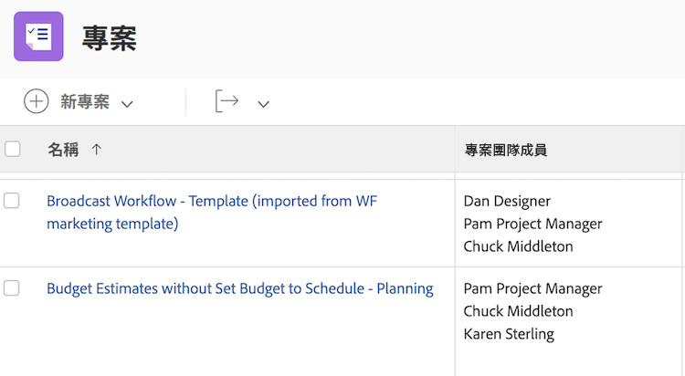

# 瞭解檢視的基本文字模式


>[!IMPORTANT]
>
>先決條件：
>
>* 瞭解報表元素
>* 瞭解報表元件
>* 建立基本檢視

>[!TIP]
>
>* 若要更深入地瞭解文字模式，我們建議您觀看錄製的網路研討會活動 [詢問專家 — 文字模式報告簡介](https://experienceleague.adobe.com/docs/workfront-events/events/reporting-and-dashboards/introduction-to-text-mode-reporting.html?lang=en)，長度為一小時。
>* 若要進一步瞭解文字模式，建議您觀看 [進階報告](https://experienceleague.adobe.com/docs/workfront-learn/tutorials-workfront/reporting/advanced-reporting/welcome-to-advanced-reporting.html?lang=en) 教學課程，總共有五個半小時的長度。

在本影片中，您將瞭解：

* 什麼是文字模式
* 什麼是駝峰式大小寫
* 您可以在檢視中使用一些基本的「隨插即用」文字模式

>[!VIDEO](https://video.tv.adobe.com/v/3410571/?quality=12&learn=on)

## 任務 — 4個父檢視

先為「工作名稱」和「父系名稱」建立欄，然後使用下列文字模式建立其他三個欄。

### 任務 — 父系名稱的父系

```
displayname=Parent of Parent Name
linkedname=parent
namekey=view.relatedcolumn
namekeyargkey.0=parent
namekeyargkey.1=name
querysort=parent:parent:name
textmode=true
valuefield=parent:parent:name
valueformat=HTML
```

### 任務 — 父項名稱的父項

```
displayname=Parent of Parent of Parent Name
linkedname=parent
namekey=view.relatedcolumn
namekeyargkey.0=parent
namekeyargkey.1=name
querysort=parent:parent:parent:name
textmode=true
valuefield=parent:parent:parent:name
valueformat=HTML
```

### 任務 — 父項名稱父項的父項

```
displayname=Parent of Parent of Parent of Parent Name
linkedname=parent
namekey=view.relatedcolumn
namekeyargkey.0=parent
namekeyargkey.1=name
querysort=parent:parent:parent:parent:name
textmode=true
valuefield=parent:parent:parent:parent:name
valueformat=HTML
```


## 使用者 — 在使用者檢視中顯示清單的反複專案

### 使用者 — 所有職位角色

```
displayname=All job roles
listdelimiter=<p>
listmethod=nested(userRoles).lists
textmode=true
type=iterate
valuefield=role:name
valueformat=HTML
```

### 使用者 — 所有顯示主要的工作角色

```
displayname=All Job Roles showing primary
listdelimiter=<p> 
listmethod=nested(userRoles).lists 
textmode=true
type=iterate 
valueexpression=IF({user}.{roleID}={role}.{ID},CONCAT("** ",{role}.{name}," **"),{role}.{name})
valueformat=HTML
```

### 使用者 — 所有團隊

```
displayname=All teams
listdelimiter=<p>
listmethod=nested(teams).lists
textmode=true
type=iterate
valueexpression={name}
valueformat=HTML
```

>[!NOTE]
>
>有一個可透過UI存取的團隊欄位，該欄位顯示所有團隊，以逗號分隔，但使用上面的文字模式將在單獨的一行中顯示每個團隊。


### 使用者 — 所有群組

```
displayname=All groups
listdelimiter=<p>
listmethod=nested(userGroups).lists
textmode=true
type=iterate
valuefield=group:name
valueformat=HTML
```

### 使用者 — 顯示主群組的所有群組

```
displayname=All groups showing home group
listdelimiter=<p>
listmethod=nested(userGroups).lists
textmode=true
type=iterate
valueexpression=IF({user}.{homeGroupID}={group}.{ID},CONCAT("** ",{group}.{name}," **"),{group}.{name})
valueformat=HTML
```


### 使用者 — 直接下屬

```
displayname=Direct reports
listdelimiter=<p>
listmethod=nested(directReports).lists
textmode=true
type=iterate
valueexpression={name}
valueformat=HTML
```

### 使用者 — 未來PTO

```
displayname=Future PTO
listdelimiter=<br>
listmethod=nested(reservedTimes).lists
namekey=group.plural
textmode=true
type=iterate
valueexpression=IF({startDate}>$$TODAY,CONCAT({startDate}," - ",{endDate}),"")
valueformat=HTML
width=150
```


## 任務 — 如何顯示任務指派和處理狀態

```
displayname=Assignments and Status
listdelimiter=<br>
listmethod=nested(assignments).lists
namekey=group.plural
textmode=true
type=iterate
valueexpression=CONCAT({assignedTo}.{name},IF(ISBLANK({assignedTo}.{name}),"",IF({status}="AA"," - Requested",IF({status}="AD"," - Working"," - Done"))))
valueformat=HTML
width=150
```


## 任務 — 如何顯示多個任務指派的角色和配置

### 任務 — 角色+小時

```
displayname=Role+hours
listdelimiter=<li>
listmethod=nested(assignments).lists
textmode=true
type=iterate
valueexpression=CONCAT({role}.{name}," (",round({workRequired}/60,2),")")
valueformat=HTML
```

### 任務 — 指派+百分比分配

```
displayname=Assignment+percent
valueexpression=CONCAT({assignedTo}.{name}," (",{assignmentPercent},")")
listdelimiter=<li>
listmethod=nested(assignments).lists
valueformat=HTML
textmode=true
type=iterate
```


## 任務 — 跨專案前置任務與後置任務

### 任務篩選（選擇性）

**顯示至少有一個跨專案前置任務的所有任務**

```
predecessorsMM:ID_Mod=notblank
predecessorsMM:projectID=FIELD:projectID
predecessorsMM:projectID_Mod=ne
```

### 任務 — 顯示前置任務名稱和前置任務所在專案

```
displayname=Predecessor names
listdelimiter=<br>
listmethod=nested(predecessors).lists
namekey=group.plural
textmode=true
type=iterate
valueexpression=CONCAT("TASK = ",{predecessor}.{name}," >> PROJECT = ",{predecessor}.{project}.{name})
valueformat=HTML
width=150
```

### 任務 — 顯示後續任務名稱，且專案後續任務已加入

```
displayname=Successor names
listdelimiter=<br>
listmethod=nested(successors).lists
namekey=group.plural
textmode=true
type=iterate
valueexpression=CONCAT("TASK = ",{successor}.{name}," >> PROJECT = ",{successor}.{project}.{name})
valueformat=HTML
width=150
```

### 任務 — 顯示前置任務的預計完成日期

```
displayname=Predecessor projected completion dates
valueformat=atDate
listdelimiter=
textmode=true
width=90
stretch=0
valuefield=predecessor:projectedCompletionDate
type=iterate
listmethod=nested(predecessors).lists
shortview=false
```

### 任務 — 顯示前置任務的進度狀態

```
displayname=Predecessor progress status
listdelimiter=<br>
listmethod=nested(predecessors).lists
shortview=false
stretch=0
textmode=true
type=iterate
valueexpression=IF({predecessor}.{progressStatus}="OT","On Time",IF({predecessor}.{progressStatus}="LT","Late",IF({predecessor}.{progressStatus}="BH","Behind","At Risk")))
valueformat=HTML
width=90
```

### 任務 — 顯示跨專案前置任務專案的完成百分比

```
displayname=Predecessor project percent complete
listdelimiter=<br>
listmethod=nested(predecessors).lists
namekey=group.plural
textmode=true
type=iterate
valueexpression=IF({isCP}=true,CONCAT({predecessor}.{project}.{percentComplete},"%"),"")
valueformat=HTML
width=150
```


## 任務 — 反複專案顯示所有指派的人員及指派每個人員

```
displayname=All assignees and requesters
listdelimiter=<p>
listmethod=nested(assignments).lists
textmode=true
type=iterate
valueexpression=CONCAT("Assigned To: ",{assignedTo}.{name},"; Requested By: ",{assignedBy}.{name})
valueformat=HTML
```


## 任務/專案 — 反複專案顯示專案或任務上的所有自訂表單

```
displayname=All Forms Assigned
listdelimiter=<p>
listmethod=nested(objectCategories).lists
textmode=true
type=iterate
valuefield=category:name
valueformat=HTML
```


## 專案 — 反複專案在專案檢視中顯示可解析專案的所有主要連絡人

```
displayname=Requestor
listdelimiter=<br>
listmethod=nested(resolvables).lists
namekey=group.plural
textmode=true
type=iterate
valuefield=owner:name
valueformat=HTML
width=150
```


## 專案 — 反複專案顯示所有專案團隊成員

```
displayname=Project Team Members
listdelimiter=<br>
listmethod=nested(projectUsers).lists
namekey=group.plural
textmode=true
type=iterate
valuefield=user:name
valueformat=HTML
```



## 專案 — 反複專案顯示專案所有可解決問題的專案日期

```
displayname=Resolvables entry date
linkedname=direct
listdelimiter=<br>
listmethod=nested(project.resolvables).lists
listsort=string(description)
querysort=description
section=0
textmode=true
type=iterate
valuefield=entryDate
valueformat=HTML
```


## 專案 — 顯示原始專案請求者的主群組

```
displayname=Requestor home group
linkedname=direct
namekey=name
querysort=convertedOpTaskOriginator:homeGroup:name
textmode=true
valuefield=convertedOpTaskOriginator:homeGroup:name
valueformat=HTML
```


## 專案 — 顯示專案是否為請求佇列

```
querysort=queueDef:isPublic
valueformat=val
description=0 (None), 1 (Public), 2 (Private), 3 (Company), 4 (Group)
linkedname=direct
textmode=true
enumtype=PROJ
valuefield=queueDef:isPublic
namekey=status
type=enum
enumclass=com.attask.common.constants.ProjectStatusEnum
displayname=Public Selection
```


## 問題 — 反複專案顯示所有已解決的專案團隊成員

```
displayname=Resolve Project: Team Members
listdelimiter=<br>
listmethod=nested(resolveProject.projectUsers).lists
namekey=group.plural
textmode=true
type=iterate
valuefield=user:name
valueformat=HTML
width=150
```


## 問題 — 反複專案顯示問題主要連絡人的所有團隊

```
displayname=Requestor Teams
listdelimiter=<br>
listmethod=nested(owner.teams).lists
namekey=group.plural
textmode=true
type=iterate
valuefield=name
valueformat=HTML
width=150
```


## 檔案 — 反複專案顯示檔案報告中的資料夾

```
displayname=Folder
listdelimiter=<br><br>
listmethod=nested(folders).lists
textmode=true
type=iterate
valuefield=name
valueformat=HTML
```


## 檔案 — 在檔案報告中顯示父資料夾的反複專案

```
displayname=Parent Folder
listdelimiter=<br><br>
listmethod=nested(folders).lists
textmode=true
type=iterate
valuefield=parent:name
valueformat=HTML
```


## 檔案 — 檔案核准日期

```
displayname=Document approval dates
valueformat=HTML
listdelimiter=<br>
linkedname=direct
textmode=true
listsort=string(description)
valuefield=approvalDate
type=iterate
listmethod=nested(approvals).lists
shortview=false
section=0
```


## 校訂核准

### 校訂核准 — 顯示專案名稱

```
displayname=Project Name
textmode=true 
valuefield=documentVersion:document:project:name 
valueformat=HTML
```

### 校訂核准 — 顯示任務名稱

```
displayname=Task Name
textmode=true 
valuefield=documentVersion:document:task:name 
valueformat=HTML
```


