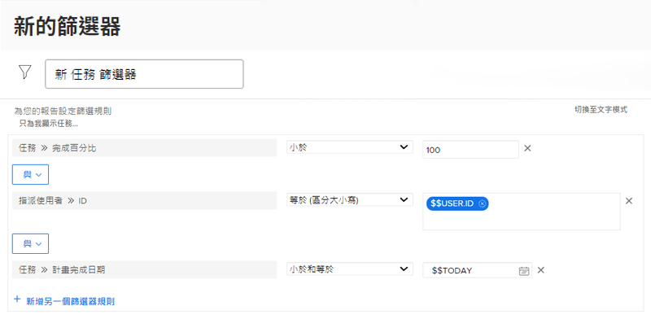

# 使用日期型萬用字元建立篩選

在此影片中，您將學習如何：

* 了解何時應使用日期萬用字元
* 了解Workfront的兩個日期型萬用字元之間的差異
* 新增日期型萬用字元至篩選器
* 使用萬用字元、屬性、運算子和修飾元建立自訂日期
* 使用萬用字元建立自訂日期範圍

>[!VIDEO](https://video.tv.adobe.com/v/336812/?quality=12)

## 活動問題

1. 如果您想要的問題到期日為昨天或今天，如何建立篩選規則？
1. 如何建立篩選規則，以尋找上週到期的專案？
1. 下列篩選規則是您定期使用之任務報表的一部分。 您會從此報表獲得什麼類型的結果？

## 答案

1. 篩選下列日期之間的發行計畫完成日期 [!UICONTROL $$今天–1d] 和 [!UICONTROL 今天$].
1. 篩選項目計畫完成日期，介於 [!UICONTROL $$TODAYb-1w] 和 [!UICONTROL $TODAYe-1w].
1. 此報告會查找分配給您的任務，這些任務尚未完成（換句話說，完成百分比小於100），並且這些任務已逾期或今天到期。 任務的計畫完成日期的篩選規則指示查看到期日等於或早於今天日期的任務。
