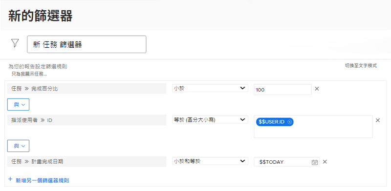

# 建立含有日期型萬用字元的篩選器

觀看這段影片，您將了解如何：

* 知道何時要使用日期型萬用字元
* 了解兩種 Workfront 日期型萬用字元之間的差異
* 新增日期型萬用字元到篩選器中
* 使用萬用字元、屬性、運算子和修飾元來建立自訂日期
* 使用萬用字元建立自訂日期範圍

>[!VIDEO](https://video.tv.adobe.com/v/336812/?quality=12&learn=on&enablevpops=0)

## 「建立含有日期型萬用字元的篩選器」活動

### 活動問題

1. 如果您要把問題的截止日期設為昨天或今天，您該如何建置篩選規則？
1. 您要如何建置篩選規則來尋找上週到期的專案？
1. 以下篩選規則取自您經常使用的任務報告： 您將從這份報告中得到什麼類型的結果？

### 解答

1. 篩選介於 [!UICONTROL $$TODAY-1d] 和 [!UICONTROL $$TODAY] 之間的問題規劃完成日期。
1. 篩選介於 [!UICONTROL $$TODAYb-1w] 和 [!UICONTROL $$TODAYe-1w] 之間的專案規劃完成日期。
1. 這份報告會尋找已經指派給您，但尚未完成 (即完成百分比少於 100) 而且已逾期或今天到期的任務。 任務的規劃完成日期篩選規則指明尋找到期日期等於或早於今天的任務。
