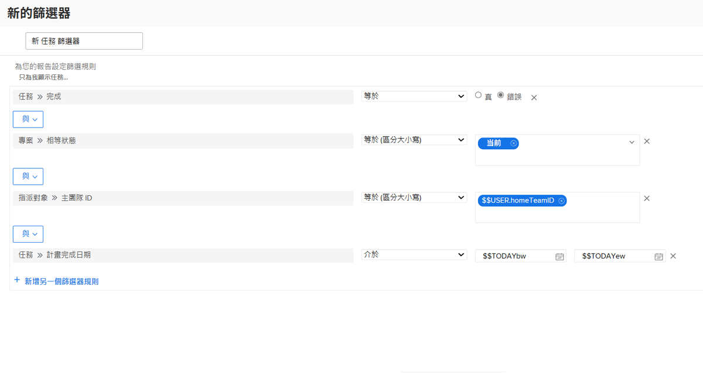

# 使用基於使用者的萬用字元建立篩選器

觀看這段影片，您將了解如何：

* 了解為何要使用萬用字元
* 使用基於使用者的萬用字元建立篩選器

>[!VIDEO](https://video.tv.adobe.com/v/336810/?quality=12&learn=on&enablevpops=0)

>[!TIP]
>
>建立搜尋任務或問題指派資料的篩選器時，請使用「指派使用者>>ID」欄位來源和名稱。  此選項會檢視指派給任務或問題的所有使用者，而不僅僅是「所有者」或主要受指派人。

>[!TIP]
>
>即使是建立自己使用的篩選器，亦請使用 $$USER.ID (而不是您的名稱)。 這樣一來，若有人看到您所執行的篩選器並要求共用時，該篩選器的原本設定即可讓每個人看到自己的資訊。

>[!TIP]
>
>使用基於使用者的萬用字元時，您一定要使用「等於」篩選限定詞。

## 「使用基於使用者的萬用字元建立篩選器」活動

### 活動 1

您這一週多了一些空閒時間，所以想要看看團隊中是否有人需要協助處理他們的指派工作。 建立任務篩選器以尋找指派給您的主團隊本週到期且尚未完成的任務。

### 解答 1

您對團隊同事伸出援手實在是太棒了！ 利用如下圖所示的篩選器設定，您即可找到符合以下條件的任務：

* 尚未完成 (表示其狀態並非「[!UICONTROL 完成]」也不等同於「[!UICONTROL 完成]」)；
* 屬於狀態為「[!UICONTROL 目前]」的專案 (畢竟您不想找到尚未啟動的專案的任務)；
* 已指派給您的主團隊中某名成員，主團隊的定義按照 Workfront 團隊設定；
* 以及完成日期為本週某日 (此規則使用預先建立的日期篩選器來定義「本週」)。

如果您想要對清單設定更多限制，您可能要新增其他篩選器。 例如，您可能想要新增篩選規則去搜尋您的團隊負責的特定方案或專案組合。
