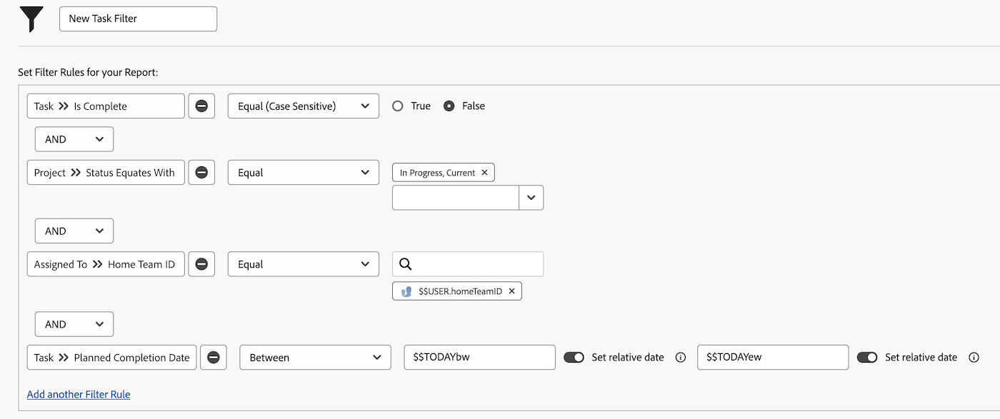

# 使用使用者型萬用字元建立篩選器

在本影片中，您將瞭解如何：

* 瞭解為何使用萬用字元
* 使用使用者型萬用字元建立篩選器

>[!VIDEO](https://video.tv.adobe.com/v/336810/?quality=12&learn=on)

>[!TIP]
>
>在建立可檢視任務或問題指派資訊的篩選器時，使用「指派使用者」>>「ID」欄位來源和名稱。  此選項會檢視指派給任務或問題的所有使用者，而不僅僅是「所有者」或主要受指派人。

>[!TIP]
>
>使用$$USER.ID （而非您的名稱），即使您自己建立篩選器亦然。 這樣的話，如果有人看到您正在執行的篩選器並說「請和我共用」，則篩選器已經設定，因此每個使用它的人都會看到自己的資訊。

>[!TIP]
>
>使用以使用者為基礎的萬用字元時，您必須一律使用相等篩選限定詞。

## 活動

您這週有一些額外的時間，所以您想要檢視您的團隊中是否有任何人在他們的任務中可以使用一些協助。 建立任務篩選器以尋找本週到期但尚未完成的任務。

## 答案

您是協助隊友的絕佳人選！ 設定如下圖所示的篩選器後，您會找到工作：

* 尚未完成(表示他們沒有 [!UICONTROL 完成] 相等於 [!UICONTROL 完成])；
* 位於具有的專案中的 [!UICONTROL 目前] 狀態（畢竟，您不想為尚未啟動的專案尋找任務）；
* 如Workfront團隊設定所定義，指派給主團隊某人的資訊；
* 而完成日期為本週某個時間的（此規則使用預先建立的日期篩選器來定義「本週」）。

如果您需要進一步限制清單，則可能需要新增一些其他篩選器。 例如，您可能想要新增篩選規則，檢視您團隊正在處理的特定方案或投資組合。
