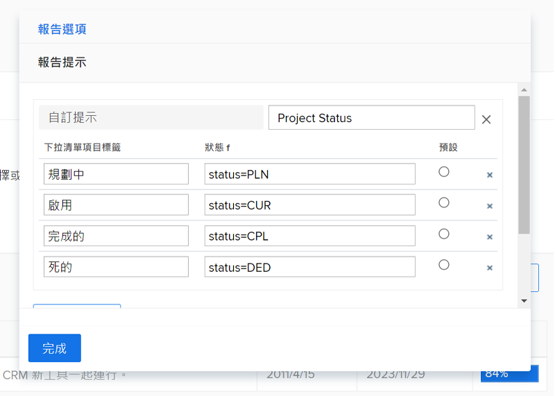
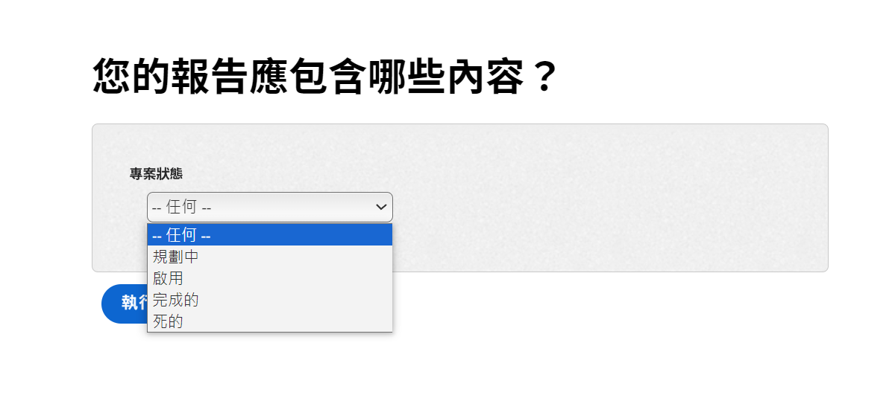
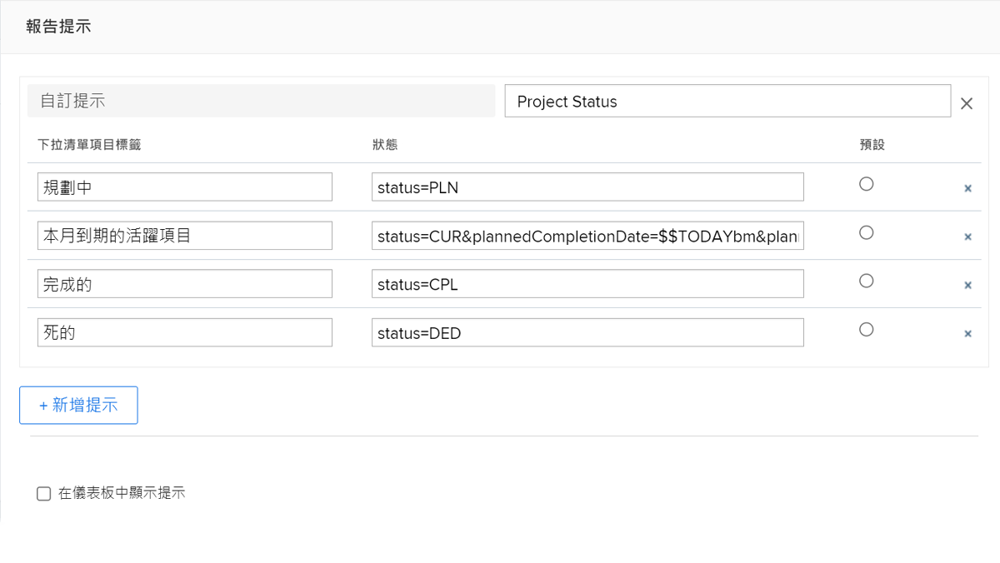

# 建立自訂提示

觀看這段影片，您將會了解：

* 什麼是自訂提示
* 如何使用文字模式來建立自訂提示
* 您可以在報告中使用的一些範例

>[!VIDEO](https://video.tv.adobe.com/v/336822/?quality=12&learn=on)

## 「建立自訂提示」活動


### 活動：建立自訂提示

1. 建立自訂提示並在提示下拉式選單中顯示下列專案狀態：
   * 計畫
   * 目前
   * 已完成
   * 廢棄
1. 修改提示以顯示本月到期的目前項目。

### 解答

1. 您的自訂提示應與下圖相似，且具有以下文字模式：

   

   您儲存自訂提示之後，提示下拉式選單應如下所示：

1. 您的自訂提示中的文字模式應如下所示：



```
   status=CUR&plannedCompletionDate=$$TODAYbm&plannedCompletionDate_Mod=between&plannedCompletionDate_Range=$$TODAYem 
```

使用中提示的下拉式標籤應該更新以反映程式碼的變更，如下所示：


