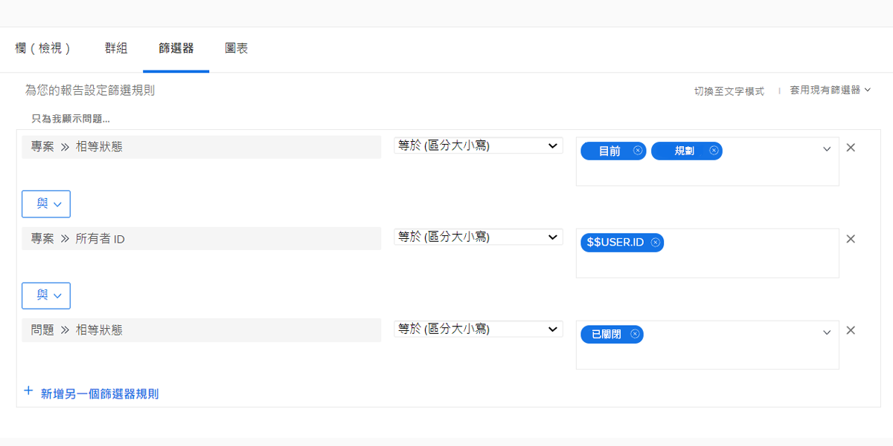
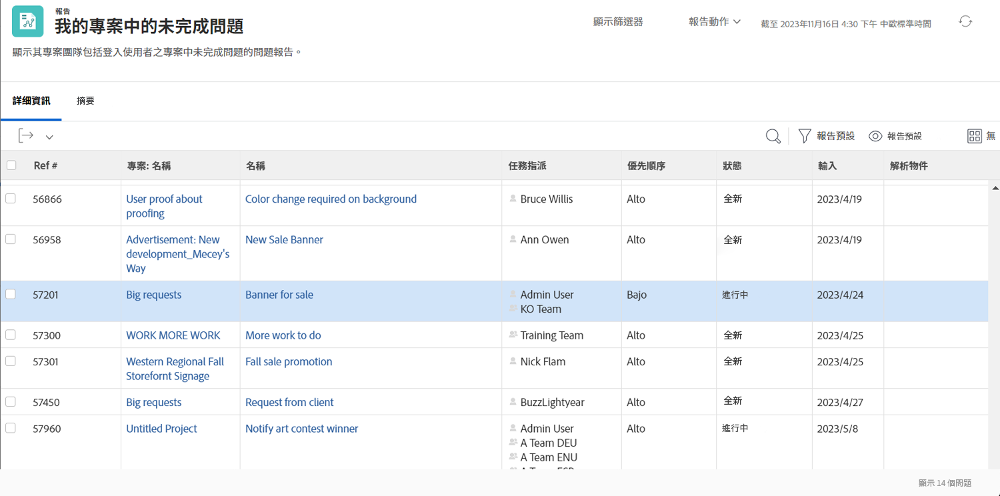

# 了解內建的問題篩選

在此影片中，您會：

* 檢閱內建的問題篩選器，了解其建置方式
* 了解一些有用的問題報告元素
* 了解如何建立自己的問題篩選

>[!VIDEO](https://video.tv.adobe.com/v/336819/?quality=12)

## 活動：建立問題報告

您想查看所有您擁有的使用中專案仍需要解決的問題，包括解決物件的問題。 建立問題報告，並將其命名為「我擁有的專案上未解決的問題」。

## 回答

篩選器的外觀如下：

在「我的未結問題」內建篩選器中，其中一個篩選規則會排除任何有解決物件的問題。 其背後的理由是，你不必擔心這些問題。 有人已建立專案、任務或問題來解決這些問題，有什麼好擔心的？ 但是它們還沒有解決，在我們的例子中，我們將它們包括在內，以便讓它們易於識別和檢查它們是如何工作的。

為此，您需要在「問題>>解析對象」的視圖頁簽中添加一列。 如果存在，則顯示解析對象的名稱（無論是項目、任務還是問題）。 按一下名稱即會前往解析物件。

您可能會想要根據專案名稱對清單進行分組。

以下是報表的外觀：

