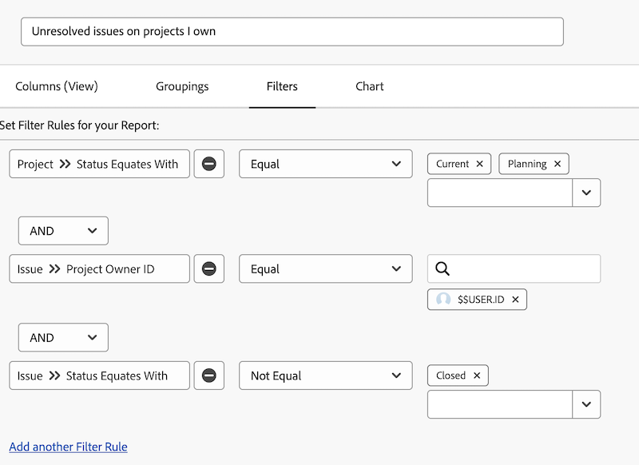

# 探索內建問題篩選器

觀看這段影片，您將：

* 審閱內建的問題篩選器以了解其建置方式
* 了解一些有用的問題報告元素
* 了解如何建立您自己的問題篩選器

>[!VIDEO](https://video.tv.adobe.com/v/336819/?quality=12&learn=on&enablevpops=0)

## 「了解內建的問題篩選器」活動

### 活動：建立問題報告

您想要查看在您擁有的所有進行中專案上，仍有待解決的所有問題，包括含有解決物件的問題。建立問題報告並將其命名為「我擁有的專案中未解決的問題」。

### 解答

篩選器應如下所示：

在「我的未決問題」內建篩選器中，其中一個篩選規則會排除含有解決物件的任何問題。其背後原因是讓您不必擔心那些問題。有人已經建立了可以解決這些問題的專案、任務或問題，還有什麼需要擔心呢？但是問題尚未解決，而在我們的範例中也包含這些問題，以使其易於識別，也能確認這些問題的現況。

若要這樣做，您必須在「問題 >> 解決物件」的的視圖標籤中新增一欄。這樣會顯示解決物件的名稱，若有的話，無論是專案、任務或問題。按一下名稱即可前往該解決物件。

您可能想要根據專案名稱將清單分組。

報告應如下所示：

