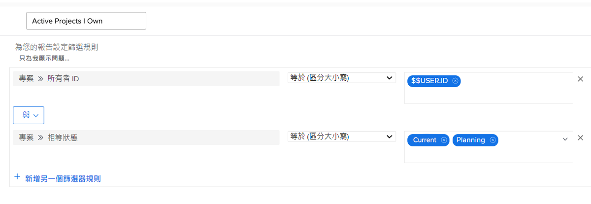

# 瞭解內建專案篩選器

在本影片中，您將瞭解如何：

* 檢閱內建專案篩選器，瞭解其建置方式
* 使用您學到的知識建立您自己的專案篩選器

>[!VIDEO](https://video.tv.adobe.com/v/336817/?quality=12&learn=on)

## 活動：建立專案篩選

您想要檢視所有您擁有的有效專案，其中「有效」表示專案狀態等於「計畫」或「目前」。 在「專案」區域中，建立名為「我擁有的活動專案」的專案篩選器。

## 答案

您的篩選器應如下所示：

您可以包含其他篩選規則，例如，尋找特定方案或投資組合中的專案。 若您這麼做，Workfront建議您將該篩選器重新命名為描述性適當的專案，例如「行銷Portfolio中我擁有的活動專案」。
