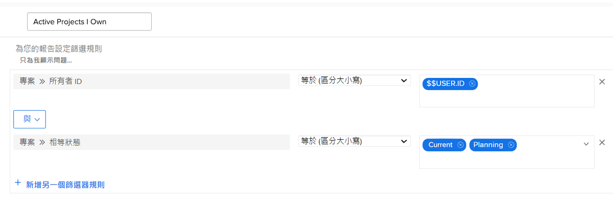

# 探索內建專案篩選器

觀看這段影片，您將了解如何：

* 審閱內建的專案篩選器來了解其建置方式
* 使用您所學到的知識建立自己的專案篩選器

>[!VIDEO](https://video.tv.adobe.com/v/3469867/?captions=chi_hant&quality=12&learn=on&enablevpops=0)

## 「了解內建的專案篩選器」活動

### 活動：建立專案篩選器

您想要查看自己擁有的所有進行中的專案，而「進行中」是指專案狀態等同於「規劃」或「目前」。 在「專案」區域中，建立名為「我擁有的進行中的專案」的專案篩選器。

### 解答

您的篩選器如下所示：

您可以包含更多篩選規則，例如在某個方案或專案組合中尋找專案。 當您這樣做時，Workfront 建議您將篩選器重新命名為適當的描述性名稱，例如「我在行銷專案組合中擁有的進行中專案」。
