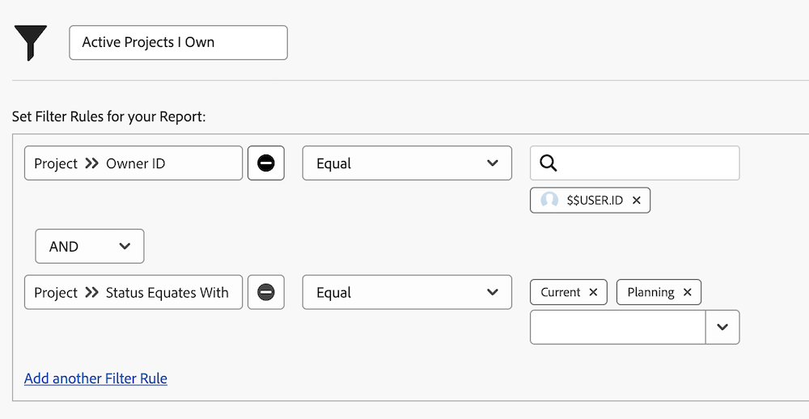

# 了解內建的專案篩選器

在此影片中，您將學習如何：

* 檢閱內建的專案篩選器，以了解其建置方式
* 使用您所學到的內容建立您自己的專案篩選

>[!VIDEO](https://video.tv.adobe.com/v/336817/?quality=12)

## 活動：建立項目檔案管理器

您想要查看您擁有的所有活動項目，其中「活動」表示項目狀態相當於「計畫」或「當前」。 在「專案」區域中，建立名為「我擁有的作用中專案」的專案篩選器。

## 回答

您的篩選器應如下所示：

您可以包含其他篩選規則，例如尋找特定方案或產品組合中的專案。 執行此動作時，Workfront建議您將篩選器重新命名為描述性的名稱，例如「行銷Portfolio中我擁有的作用中專案」。
