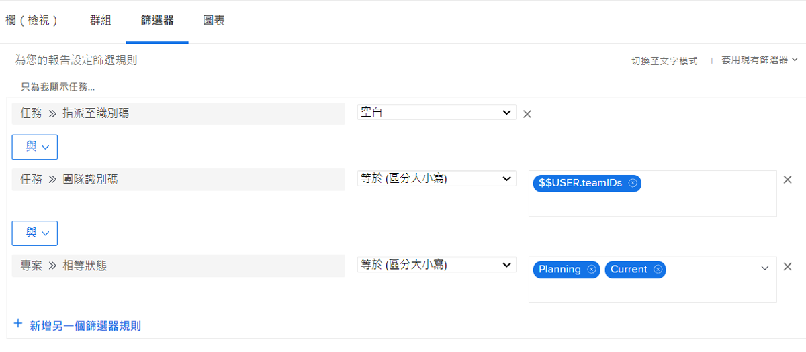
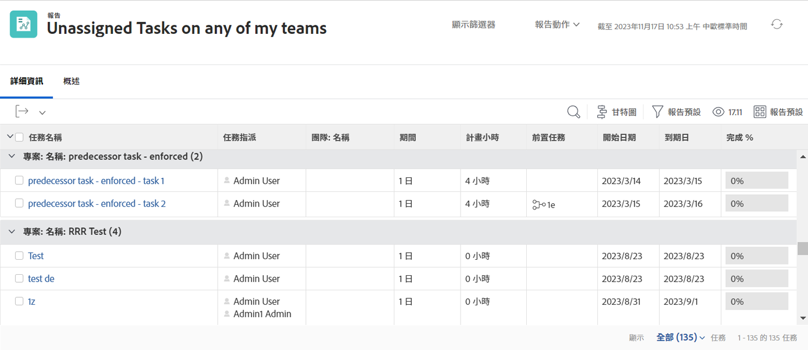

# 了解內建的任務篩選器

觀看這段影片，您將：

* 審閱內建的任務篩選器以了解其建置方式
* 了解一些實用的任務報告元素
* 了解如何建立您的任務篩選器

>[!VIDEO] (https://video.tv.adobe.com/v/336818/?quality=12&learn=on&enablevpops=0

## 「了解內建的任務篩選器」活動

### 活動：建立任務報告

您想要確保自己能夠發現指派給您其中一個團隊但是尚未有任何人同意執行的任務。建立一份名為「我的任何團隊的未指派任務」的任務報告。

### 解答

篩選器應如下所示：

設定欄視圖，以包含您有興趣瞭解或想要允許行間編輯的欄位。例如，您可以包含「指派」欄，讓您可以直接從報告把任務指派給團隊成員。

您可能希望根據指派給各個任務的團隊名稱來將清單分組。

以下是報表的外觀：

