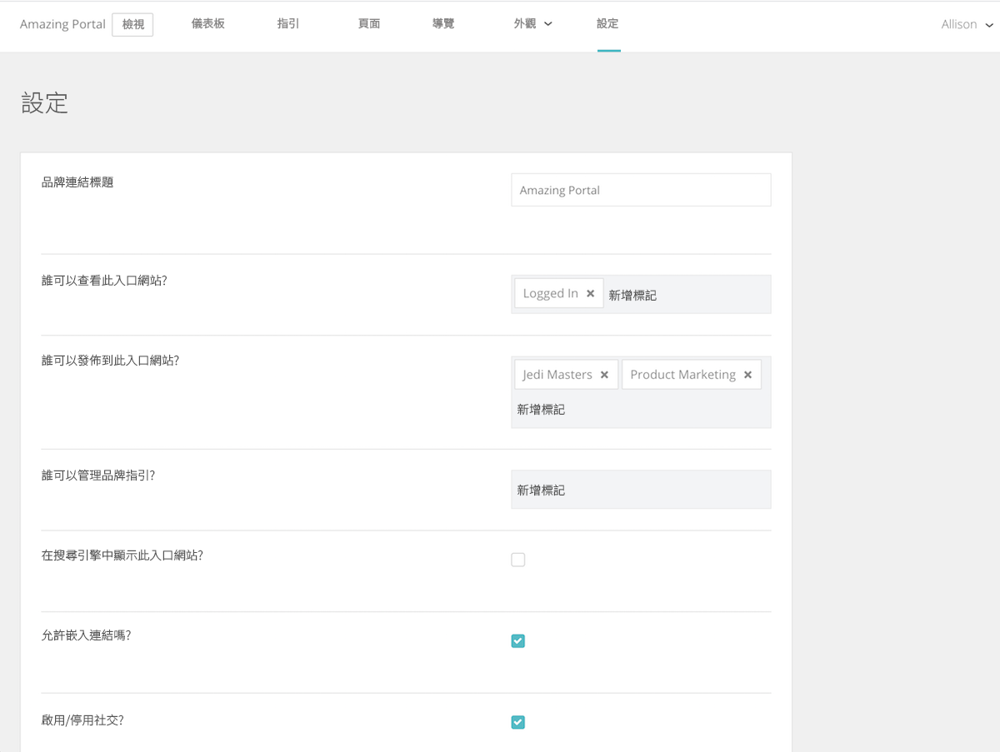

# 在 [!UICONTROL Brand Connect]

此 [!UICONTROL Brand Connect] 設定可控制誰可以查看入口網站、誰可以將內容發佈至入口網站，以及誰可以管理品牌准則。

若要存取設定，請登入 [!UICONTROL Workfront DAM].

1. 按一下 **設定圖示** 在導覽列中，並選取 **[!UICONTROL Brand Connect]**. 或按一下 **[!UICONTROL 品牌]** 的下一頁。
1. 然後按一下 **[!UICONTROL 編輯]** 選項 [!UICONTROL Brand Connect] 中。 如果貴組織有多個 [!UICONTROL 品牌連線]，請確定您編輯的是正確的。

與您的 [!UICONTROL Workfront] 顧問。

* **[!UICONTROL Brand Connect] 標題** — 為 [!UICONTROL Brand Connect] （或變更名稱）。
* **誰可以查看此門戶？** — 設定可查看 [!UICONTROL Brand Connect]. 例如，若您新增 [!UICONTROL 已登入] 群組，則所有登入的使用者都可以看到入口網站。 不過，資料夾權限仍會套用，因此即使使用者看得到入口網站，他們也無法存取資產，除非 [!UICONTROL 已登入] 組被授予該資料夾的權限。
* **誰可以發佈至此入口網站？** — 設定可發佈資產至的群組 [!UICONTROL Brand Connect]. 這些是貢獻者群組。 他們只能發佈他們有權存取的項目。
* **誰可以管理品牌准則？** — 設定可管理品牌准則的群組。 管理准則不限於管理員使用者。 您可以設定貢獻者群組以編輯准則。
* **在搜尋引擎中顯示此入口網站？** — 是否要 [!UICONTROL Brand Connect] URL，當人們在網際網路上執行搜尋時顯示？
* **是否允許內嵌連結？** — 可內嵌的連結可來自 [!UICONTROL Brand Connect]? 這會新增 [!UICONTROL 取得連結] 面板 [!UICONTROL 共用] 提供資產可內嵌連結的功能表。
* **是否啟用/停用社交功能？** — 如果social已啟用（核取方塊），使用者可以按贊資產並對資產加上註解。
* **是否啟用/禁用下載和查看計數？** — 啟用後，使用者可查看資產下載的次數，以及有多少留言。
* **首先隱藏Facet** — 隱藏顯示在 [!UICONTROL 資產] 頁面。
* **燈箱標籤** — 為選擇標籤 [!UICONTROL 燈箱] — [!UICONTROL Lightbox], [!UICONTROL 集合], [!UICONTROL 我的最愛]，或 [!UICONTROL 我的最愛].
