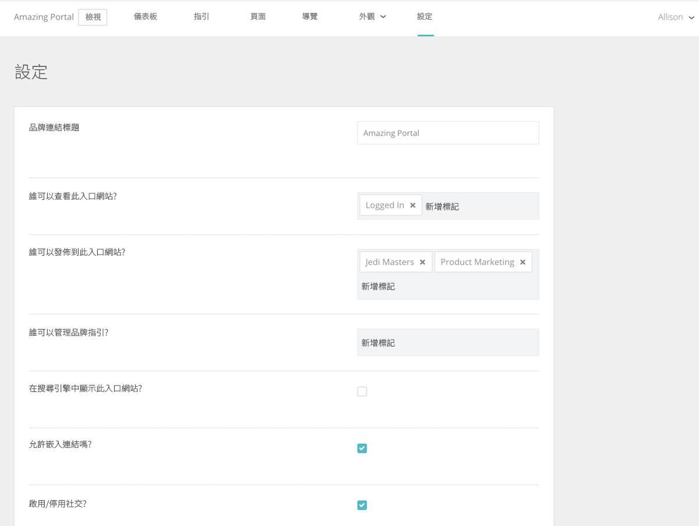

# 在 [!UICONTROL Brand Connect] 中建立系統設定

[!UICONTROL Brand Connect] 設定控制誰可以看見入口網站、誰可以對入口網站發佈內容，以及誰可以管理品牌準則。

要存取設定請登入 [!UICONTROL Workfront DAM]。

1. 按一下導覽列中的&#x200B;**設定圖示**&#x200B;並選取 **[!UICONTROL Brand Connect]**。 或在導覽列中按一下「**[!UICONTROL 品牌]**」。
1. 接著按一下 [!UICONTROL Brand Connect] 面板右上角的「**[!UICONTROL 編輯]**」選項。 如果您的組織有多個 [!UICONTROL Brand Connect]，請確認您正在編輯正確的那一個。

對於上述任何設定若有疑問，請與您的 [!UICONTROL Workfront] 顧問討論。

* **[!UICONTROL Brand Connect] 標題** — 為 [!UICONTROL Brand Connect] 命名 (或變更名稱)。
* **誰可以檢視此入口網站？** — 設定可以檢視[!UICONTROL Brand Connect]的群組。 例如，若您新增「[!UICONTROL 已登入]」群組，則所有已登入的使用者可看見該入口網站。 不過，資料夾權限仍然適用，所以即便使用者可以看見入口網站，他們仍無法存取資產，除非「[!UICONTROL 已登入]」群組取得資料夾的權限。
* **誰可以發佈至此入口網站？** — 設定可將資產發佈至[!UICONTROL Brand Connect]的群組。 這些將是貢獻者群組。 他們僅可發佈自己擁有存取權限的項目。
* **誰可以管理品牌指引？** — 設定可以管理品牌指引的群組。 管理準則並不限於管理員使用者。 您可以設定貢獻者群組來編輯準則。
* **在搜尋引擎中顯示此入口網站？** — 您是否要在網際網路上執行搜尋時顯示[!UICONTROL Brand Connect] URL？
* **允許內嵌專案連結嗎？** — 內嵌專案連結是否來自[!UICONTROL Brand Connect]？ 這樣做會在「[!UICONTROL 共用]」選單中新增「[!UICONTROL 取得連結]」面板，提供資產的可嵌入連結。
* **啟用/停用Social？** — 如果啟用Social （核取方塊），使用者可以點按和評論資產。
* **啟用/停用下載和檢視計數？** — 啟用時，使用者可以看到某個資產已下載多少次，以及它有多少注解。
* **一開始便隱藏面向** — 隱藏出現在「[!UICONTROL 資產]」頁面左側面板中的中繼資料搜尋篩選器。
* **Lightbox 標籤** — 為 [!UICONTROL Lightbox] 選取一個標籤：「[!UICONTROL Lightbox]」、「[!UICONTROL 集合]」、「[!UICONTROL 我的最愛]」或「[!UICONTROL 最愛]」。
