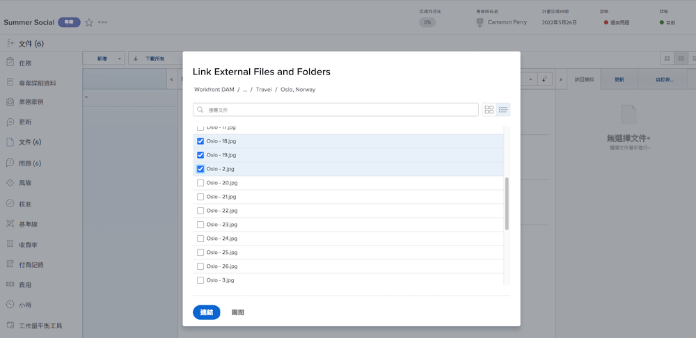

# 新增一個 [!UICONTROL Workfront DAM] 連結

開始時先設定兩個系統之間的連線。

1. 登入 [!DNL Workfront]。
1. 開啟專案、任務或問題，然後按一下「**[!UICONTROL 文件]**」標籤。
1. 按一下「**[!UICONTROL 新增]**」按鈕然後從下拉式選單選取「**[!UICONTROL 從 Workfront DAM]**」
1. 在所出現的 [!UICONTROL Workfront DAM] 授權方塊中輸入您的登入名稱和密碼。
1. 接下來，按一下「**[!UICONTROL 是]**」，把 [!DNL Workfront] 存取權授予 [!UICONTROL DAM] 帳戶。
1. 如有需要，請重新整理頁面，更新對 [!UICONTROL Workfront DAM] 的存取權。

現在您可以在 [!DNL Workfront] 中放入與 [!UICONTROL Workfront DAM] 項目的連結。

1. 登入 [!DNL Workfront]。
1. 開啟專案、任務或問題，然後按一下「**[!UICONTROL 文件]**」標籤。
1. 按一下「**[!UICONTROL 新增]**」按鈕然後從下拉式選單選取「**[!UICONTROL 從 Workfront DAM]**」
   ![影像顯示「[!UICONTROL 新增]」下拉式選單中的「[!UICONTROL 從 Workfront DAM]」選項](assets/01-contributor-from-workfront-dam.png)
1. 視窗中出現您在 [!UICONTROL Workfront DAM] 中可以存取的檔案和資料夾清單。

1. 尋找您想要的資產並勾選旁邊的方塊。預設視圖是一份清單，但您可以使用視窗右上角的圖示切換成縮圖視圖。

   

1. 按一下「**[!UICONTROL 連結]**」按鈕。文件清單中出現與 [!UICONTROL Workfront DAM] 檔案的連結。有一個圖示表示這個連結。

   ![影像顯示 [!DNL Workfront] 的文件清單中出現 [!UICONTROL Workfront DAM] 檔案的連結。](assets/03-contributor-linked-in-wf.png)
