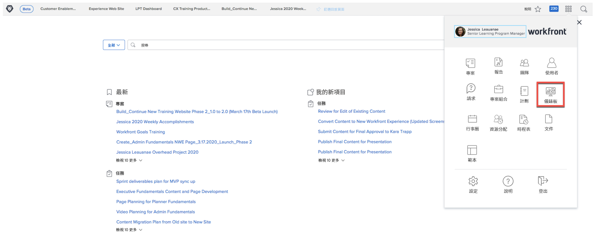
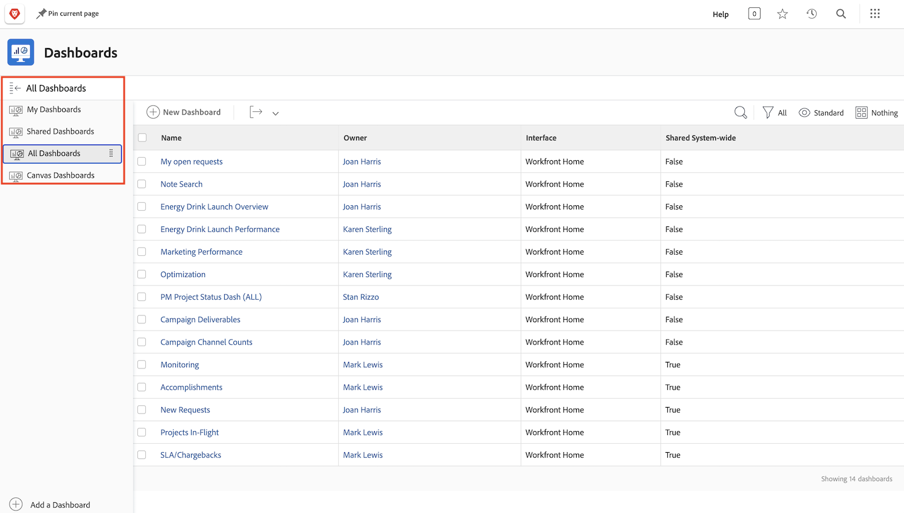
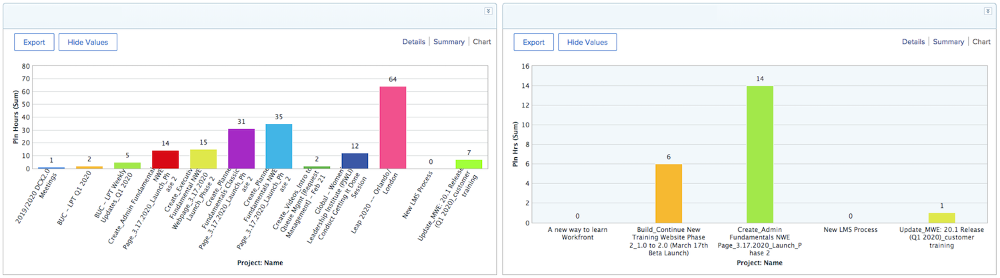
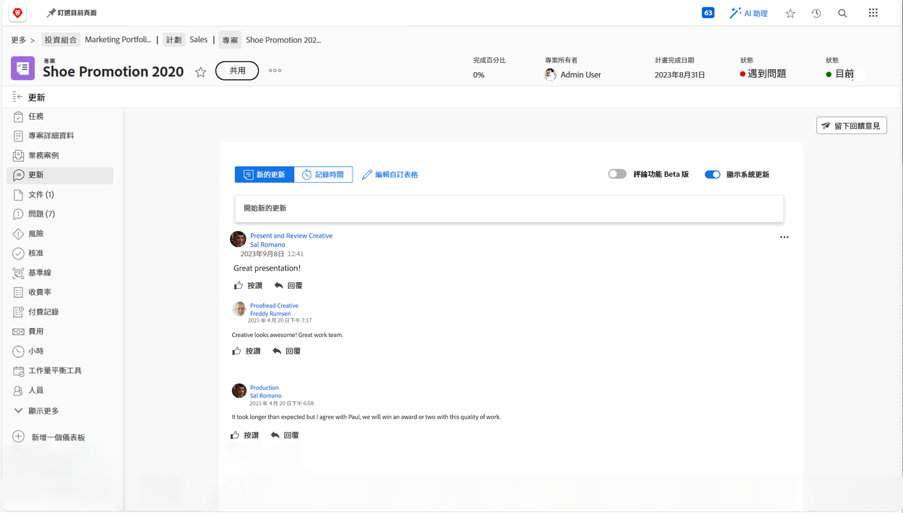
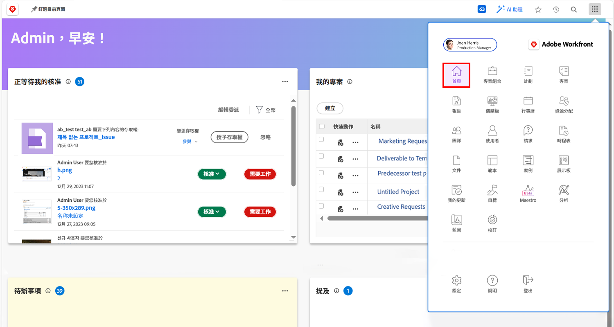

# 高階管理層適用的 Workfront

瞭解 Workfront 如何幫助您管理組織中的工作。

作為高階主管，Adobe Workfront 可以：

* 透過&#x200B;**報告和儀表板**，讓您瞭解所關心的工作進展
* 讓您可以簡單&#x200B;**使用更新與專案利害關係人溝通**
* 讓您可以簡單&#x200B;**提出工作請求**
* 讓您可以簡單檢視&#x200B;**等待您批准的項目**

## 報告和儀表板

### 報告

Workfront 的報告是讓您加速做出更好決定的重要支柱。 您在任何地方都會看到這些報告，在專案區域、人員區域或在任務登陸頁面。

領導者和高階管理層可以導覽到報告區域來檢視包含特定資訊的自訂報告。 Workfront 使用儀表板來提高最重要的報告的可見度。

### 儀表板

透過使用儀表板，主管可以檢視並快速深入瞭解其組織目前正在處理的工作的任何部分。控制面板只是報告的集合，提供主管定期檢視可能需要的資訊。 儀表板完全可以自訂，所以使用 Workfront 的任何人均可看到他們認為重要的工作。

按一下右上角主選單圖示中的「儀表板」，即可存取「儀表板」區域。

領導者可以從左側面板導覽存取他們可使用的不同儀表板。

* **所有儀表板**：顯示您或其他使用者已建立而且您至少具有檢視權限的儀表板。
* **我的儀表板**：顯示您所建置的儀表板。
* **共用儀表板**：顯示其他使用者所建立並與您共用的儀表板。

領導者可以透過儀表板審閱諸如重要專案的「成本、收入與預算」以及其團隊正在處理的未決問題。 他們也可以查看有風險的專案，以及需要高階管理層核准的項目清單。

Workfront 中的報告可以提高員工的責任感。 利用報告的關鍵在於制定組織使用報告的明確工作流程。 確保每個人都清楚瞭解要使用哪些報告來衡量成功。

Workfront 儀表板中的報告範例

## 使用更新與專案利害關係人溝通

與專案本身的專案團隊進行溝通，以便輕鬆進行所有專案溝通。

## 提出請求

在許多組織中，啟動新專案、開發新產品或建立可交付成果的第一步是在 Workfront 中提出請求。 您可以追蹤請求的進度並在必要時提供其他資訊。

觀看這段影片，您將瞭解如何：

* 導覽至請求區域
* 提出請求
* 檢視您提交的請求

>[!VIDEO](https://video.tv.adobe.com/v/3470920/?captions=chi_hant&quality=12&learn=on&enablevpops=1)

## 等待您批准的項目

在[!UICONTROL 首頁]可以輕鬆找到等待您批准的項目。

