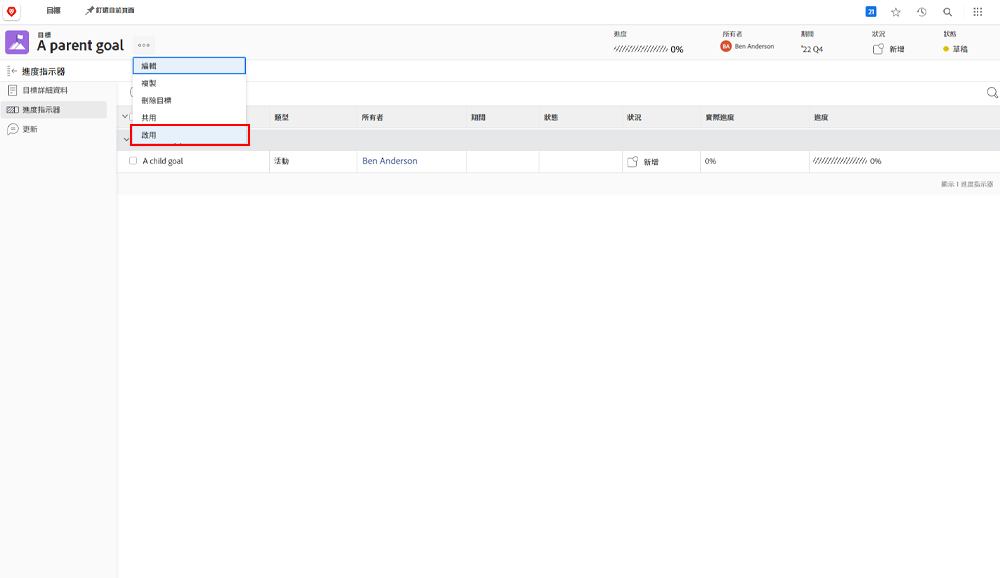

# 將目標與中的另一個目標對齊來啟動 [!DNL Workfront Goals]

當您對齊兩個目標時，一個將成為父目標，另一個將成為子目標。 父目標可以有多個子目標，但子目標只能與一個父目標對齊。

1. 按一下「 」中的「 」名稱以開啟子目標 [!UICONTROL 目標清單]. 依預設，您會發現自己位於 [!UICONTROL 目標詳細資料] 標籤。
1. 按一下 [!UICONTROL +新增] 中的按鈕 [!UICONTROL 上層目標資訊] 面板。

   ![的熒幕擷圖 [!UICONTROL 目標詳細資料] 標籤](assets/06-workfront-goals-align-goals.png)

1. 開始在「 」中輸入所需上層目標的名稱 [!UICONTROL 上層目標] 欄位，然後當它出現在清單中時選取它。 清單中只會顯示相同期間或未來期間的目標。

   ![的熒幕擷圖 [!UICONTROL 目標詳細資料] 顯示 [!UICONTROL 上層目標資訊] 面板](assets/07-workfront-goals-align-to.png)

1. 按一下 [!UICONTROL 儲存變更].

將目標對齊另一個目標會建立子目標。 您可以將子目標視為有助於組織或團隊父級目標進度的個別目標。 子目標可以啟動並影響父目標的進度。

## 現在啟用上層目標

現在您已建立子目標，該子目標就會成為父目標上的進度指示器。 當您按一下父目標名稱旁邊的三個點選單時，您會看到「啟動」選項。

