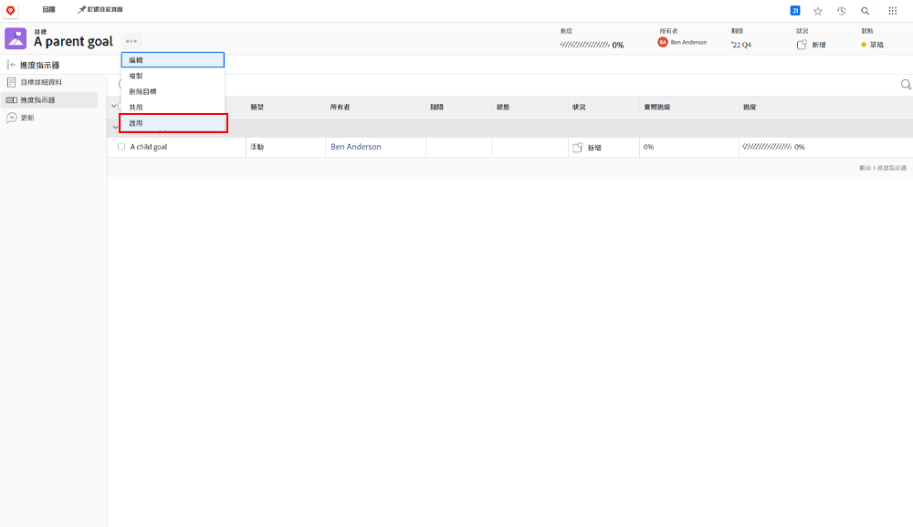

# 與其他目標維持一致來啟動目標

當您讓兩個目標維持一致時，其中一個會變成父系目標，而另一個成為子目標。 父系目標可以擁有多個子目標，但是子目標只能與一個父系目標維持一致。

1. 按一下「[!UICONTROL 目標清單]」中子目標的名稱來開啟子目標。 依預設設定，您會位在「[!UICONTROL 目標詳細資料]」標籤。
1. 在「[!UICONTROL 父系目標資訊]」面板中按一下「[!UICONTROL +新增]」按鈕。

   ![螢幕擷圖顯示「[!UICONTROL 目標詳細資料]」標籤](assets/06-workfront-goals-align-goals.png)

1. 在「[!UICONTROL 父系目標]」欄位中，開始輸入所需父系目標的名稱，當目標出現在清單中便進行選取。 清單中只會顯示來自相同期間或未來期間的目標。

   ![螢幕擷圖顯示「[!UICONTROL 目標詳細資料]」面板中顯示「[!UICONTROL 父系目標資訊]」面板](assets/07-workfront-goals-align-to.png)

1. 按一下「[!UICONTROL 儲存變更]」。

將目標與另一個目標維持一致會建立一個子目標。 將子目標視為對於組織或團隊的父系目標有推動進展之作用的個別目標。 子目標可以啟動並影響父系目標的進度。

## 現在啟動父系目標

現在您已經建立子目標並使其成為父系目標上的進度指標。 當您按一下父系目標名稱旁邊的三圓點選單時，便會看到「啟動」選項。

