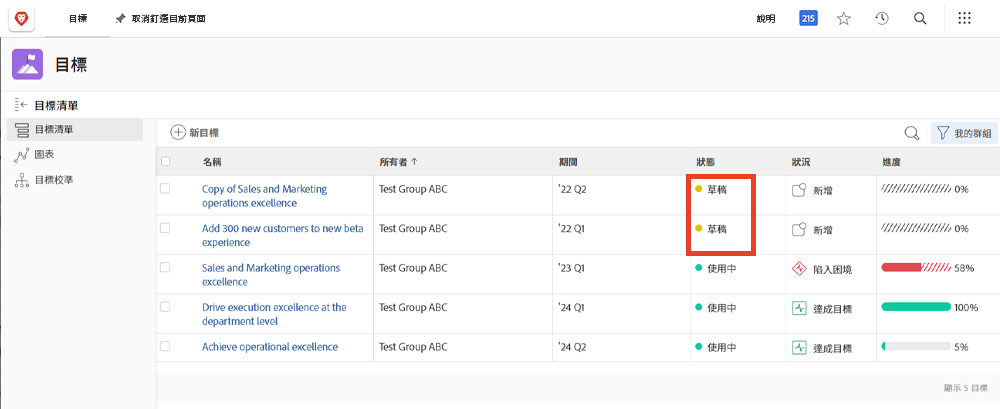
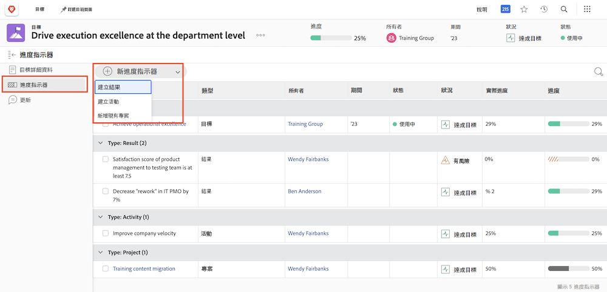
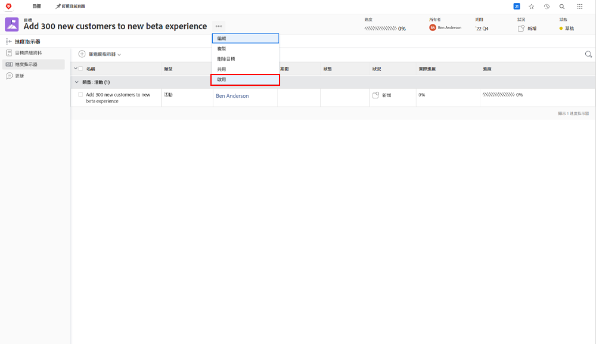

# 啟動目標

您已經建立目標，接著來啟動目標！當您建立目標時，目標會以「[!UICONTROL 草稿]」狀態儲存。「[!UICONTROL 草稿]」目標不在目標管理的範圍以內，直到您啟動目標為止。啟動之後，目標便會切換成「[!UICONTROL 作用中]」狀態，不但在儀表板中顯示進度，也會呈現其與整體策略是否維持方向一致。處於「[!UICONTROL 作用中]」狀態的目標會與進度指標相關聯，該指標通常是一項活動、結果、專案或是一致的目標 (父子目標的關係)。

## 您必須具備進度指標才能啟動目標

在繼續之前，您必須先了解 [!DNL Workfront Goals] 中使用的進度指標。進度指標是 [!DNL Goals] 中用來計算目標進度的物件。進度指標是符合策略的目標、結果、活動和專案。稍後您會更詳細了解這些內容。我們現在必須知道，符合策略的目標、結果、活動和專案必須新增到目標當中，才能啟動該目標。

要新增進度指標，請開啟目標並選取左邊的「進度指標」標籤，然後選取旁邊的「新進度指標」下拉式選單。

相較於其他進度指標，專案比較與眾不同，因為其被認定為一種活動。活動可以分成兩種不同類型 — 手動進度列及專案。結果是專案也能推動進度。雖然所有類型的進度指標都可以連結到父系目標，但是請留意，每種指標的管理方式各不相同。

## 現在啟動目標

當您的目標具有至少一種進度指標時，當您按一下目標名稱旁邊的三圓點選單時，便會看到「啟動」選項。

