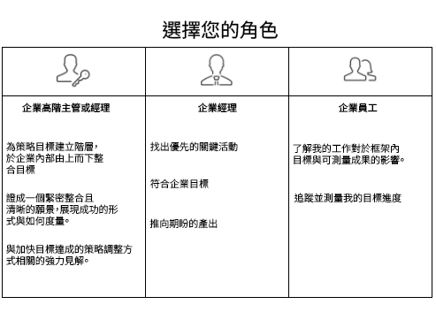

# 為您的組織設定 [!UICONTROL Workfront Goals]

*本區段內容適用於負責為使用者設定 Workfront Goals 的 [!DNL Workfront] 系統管理員。*

為了確保您的組織能快速向前發展，您必須確保工作執行情況與公司策略的方向一致。[!DNL   Goals] 協調策略、目標和工作，在整個組織推動執行並交付可衡量的業務成果。

目標最佳實務從最高的企業目標開始，然後逐層傳遞到群組、團隊和個人層級。由此產生的目標必須與公司的優先事項保持一致、有助於並支持完成公司的優先事項。在 [!DNL Workfront] 中，指出您如何達成目標的結果或活動均能支持實現目標。

## [!DNL Workfront Goals] 檢查清單

您必須滿足以下條件才可以存取 [!DNL   Goals]：

* 除了[!DNL Workfront] 授權以外，您的組織必須購買 [!DNL Workfront Goals] 授權。
* 您的組織必須使用新的 [!DNL Workfront] 體驗界面。經典 [!DNL Workfront] 介面無法使用 [!DNL Workfront Goals]。
* 您的 [!DNL Workfront Goals] 使用者必須在其存取層級擁有 [!DNL Workfront Goals] 的存取權。
* 您必須指派一個在主選單包含 [!DNL Workfront Goals] 區域的版面範本，使用者才能存取該功能。

## 誰可以使用 [!DNL Workfront Goals]

儘管個人貢獻者通常有個人目標，但我們建議使用 [!DNL Workfront Goals] 來支援貴組織實現策略目標的工作。應鼓勵組織中每個人設定與公司整體策略一致而且與其日常活動相關的目標。

閱讀下面的角色說明並決定您在 [!DNL Workfront Goals] 中的角色。

高階管理層和主管可以使用 [!DNL Workfront Goals] 進行以下動作：

* 建立可逐層傳遞到整個企業的策略目標階層。
* 用統一、明確的願景敘述成功的樣貌及其衡量標準。
* 深入分析應做哪些策略調整來加速目標進展。

個人貢獻者可以使用 [!DNL Workfront Goals] 進行以下動作：

* 使他們的目標與公司的整體策略行動方案保持一致。
* 根據策略目標衡量他們的進度與成就。
* 根據需要調整個人目標，以與業務方向保持一致。

