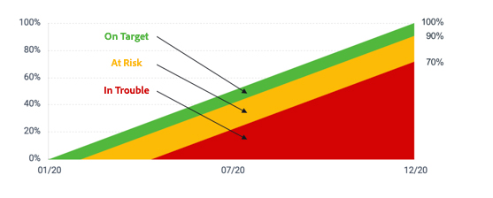

# 計算目標進度

[!DNL Workfront Goals] 計算目標進度並顯示以下資訊：

* **實際完成百分比** — 目標到目前為止已完成多少。 此值是與目標相關聯的所有進度指標完成百分比的平均值。
* **預期完成百分比** — 此時應完成多少目標，以便按時完成目標。 此值是依目標持續時間（總天數）和目前時間（自目標開始日期以來經過的總天數）計算。
* **進度** — 進度是標籤，指示目標是否按時完成，或是否有風險或無法完成。

![目標進度的螢幕擷圖 [!DNL Workfront Goals]](assets/13-workfront-goals-percent-complete.png)

下圖說明目標進度標籤與進度百分比之間的關係：

目標的進度是了解目標在根據您放入系統的更新完成時所處位置的好方法。 這就是為什麼更新您的活動並產生目標如此重要。 進度標籤有助於將標準化狀態傳達給組織的其他人員。

![覆蓋中不同進度標籤的圖形 [!DNL Workfront Goals]](assets/15-workfront-goals-progress-bar-code.png)

>[!TIP]
>
>有關用於計算目標進度的公式的詳細資訊，請瀏覽本文： [Adobe Workfront目標中的目標進度和條件概覽](https://experienceleague.adobe.com/docs/workfront/using/adobe-workfront-goals/goal-management/calculate-goal-progress.html?lang=en#overview-of-goal-progress-and-threshold).

