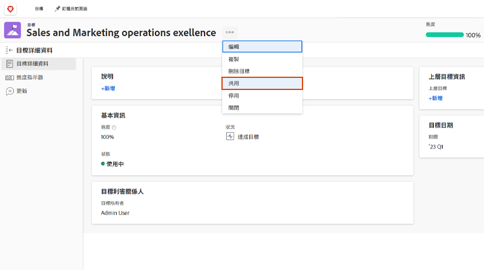

# 傳達目標狀態

現在，您已更新了目標，請花點時間退一步，以鳥瞰的方式了解您正在執行的目標，以及這些目標與團隊、團體和公司目標的關係。 就目標的進度和狀態與他人溝通是保持一致的重要部分。

有多種方式可讓適當的人員更新您的目標。 您可以透過下列方式開始：

* 共用和報告您的目標
* 善用 [!UICONTROL 圖表] 區段，以取得目標進度的完整快照

## 共用目標

您可以共用您建立的目標，或由您有權管理的其他人建立的目標。 您無法與群組、團隊或公司共用目標。 如果您有目標的「管理」權限，則可以為目標建立者變更目標的權限。 依預設，建立目標的人員具有「管理」權限，但您可以將其變更為「檢視」。

1. 按一下要從 [!DNL Goals] 開啟區域 [!UICONTROL 目標詳細資料] 中。

1. 按一下目標名稱旁的3點圖示，然後按一下 [!UICONTROL **共用**]. 此 [!UICONTROL 目標存取] 框。

   

1. 執行下列任一項作業：

   * 選取 [!UICONTROL 管理全系統] 設定，將管理權限授予系統中具有編輯存取權的每個人 [!DNL Goals] 透過 [!DNL Workfront] 存取層級。 對於所有新目標，預設會取消選取此選項。
   * 開始鍵入要指定的用戶名 [!UICONTROL 管理] 權限 [!UICONTROL 授予管理存取權] 框。 選取名稱出現在清單中時。

1. 按一下 [!UICONTROL **共用**]. 「全系統」標籤或具有目標管理權限之使用者的名稱會顯示在 [!UICONTROL 管理存取權] 欄位 [!UICONTROL 目標詳細資料] 中。

## 目標資訊報告

您可以建立目標報表或專案報表，其中包含關於 [!DNL Workfront]. 在報表中檢視目標資訊有數種方式。

* 在「報表」區域中建立目標報表。 您可以在「目標」報表上顯示有關目標的各種資訊(例如：名稱、擁有者、日期、進度等)，其中包括：

   * **目標階層** — 顯示所有父級目標及其彼此的連接方式。
   * **是公司目標** — 指出貴組織是否指定為目標的擁有者。
   * **所有者類型** — 指示目標的所有者是用戶、團隊還是組。

* 建立可顯示目標資訊的專案報表，包括下列項目：
   * **目標階層** — 顯示所有父級目標及其彼此的連接方式。
   * **目標** — 此集合欄位會顯示與專案相關聯的所有目標。
   * **連結目標數** — 與項目關聯的目標數。
