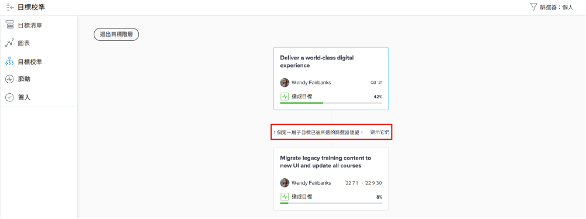

# 檢視個人目標更新

觀看這段影片，您將瞭解如何：

* 在 [!UICONTROL Pulse] 更新資料流中檢視您的個人目標

>[!VIDEO](https://video.tv.adobe.com/v/335200/?quality=12&learn=on&enablevpops)

## 篩選 Pulse 資料流中的資料

您可能注意到，有時候 [!UICONTROL Pulse] 資料流提供太多資訊，或可能不是正確的資訊。篩選摘要中的資訊，找出您想要或需要的東西。

1. 按一下左側面板上的「[!UICONTROL **Pulse**]」。
1. 按一下右上角的「[!UICONTROL **篩選器**]」圖示。
1. 選取作為篩選依據的選項：依預設套用「全部」篩選器並顯示系統中所有目標。您可以進行下列任一項作業：

   * 在篩選器面板的「[!UICONTROL 已儲存]」區段之下，選取任何預先定義的篩選器，依所有者來顯示目標 (即「[!UICONTROL 全部]」、「[!UICONTROL 個人]」、「[!UICONTROL 我的團隊]」、「[!UICONTROL 我的群組]」和「[!UICONTROL 公司]」)。
   * 將游標懸停在篩選器名稱上方，然後按一下名稱旁邊的「**編輯**」圖示進行自訂以及新增特定的使用者、團隊、群組或是貴組織的名稱。
   * 按一下「[!UICONTROL **新增篩選器**]」來建立新篩選器，然後從清單中選取自訂選項，再依「[!UICONTROL 時段]」、「[!UICONTROL 狀態]」、「[!UICONTROL 進度]」和/或「[!UICONTROL 所有者]」篩選。

   ![影像顯示[!UICONTROL 篩選器]面板，位於 [!DNL Workfront Goals]](assets/18-workfront-goals-pulse-stream.png)

**備註：**&#x200B;您所做的篩選選項將會保留，而 [!DNL Goals] 的其他區段中的資訊會根據這項資訊顯示。您可以在 [!DNL Workfront] 的 [!DNL Goals] 區域中的各個區段尋找和篩選目標。

* [!UICONTROL 目標清單]
* [!UICONTROL 圖表]
* [!UICONTROL Pulse]
* [!UICONTROL 目標一致性]。在此區段中，您可以暫時顯示與所套用篩選器不相符的目標，以便能夠全盤瞭解所有保持一致的目標。按一下「[!UICONTROL **顯示一個/顯示多個**]」選項，若有目標因為所選篩選器而隱藏起來的話。

  
