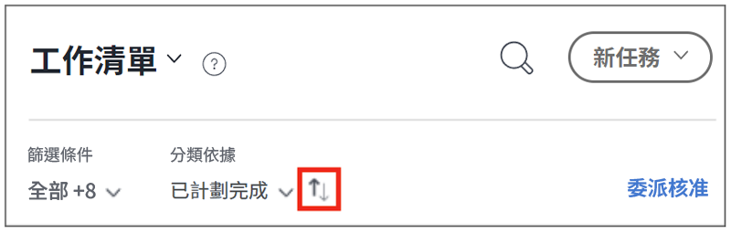

# 在 [!DNL Workfront] [!UICONTROL 首頁]

>[!NOTE]
>
>此 [!UICONTROL [!DNL Sort by]] 選項 [!UICONTROL 工作清單] 已重新命名為 [!UICONTROL 分組依據]，以及任務和問題也可依其分組 [!UICONTROL 計劃開始日期].

在此影片中，您將學習如何：

* 對工作分配進行排序
* 按類型篩選工作分配
* 識別已準備好開始的工作
* 接受工作分配

>[!VIDEO](https://video.tv.adobe.com/v/335099/?quality=12&learn=on)

>[!NOTE]
>
>依預設，最早的到期項目會顯示在 [!UICONTROL 工作清單]. 如果您希望工作項目以降序顯示，請按一下「按區域分組」右側的箭頭。

