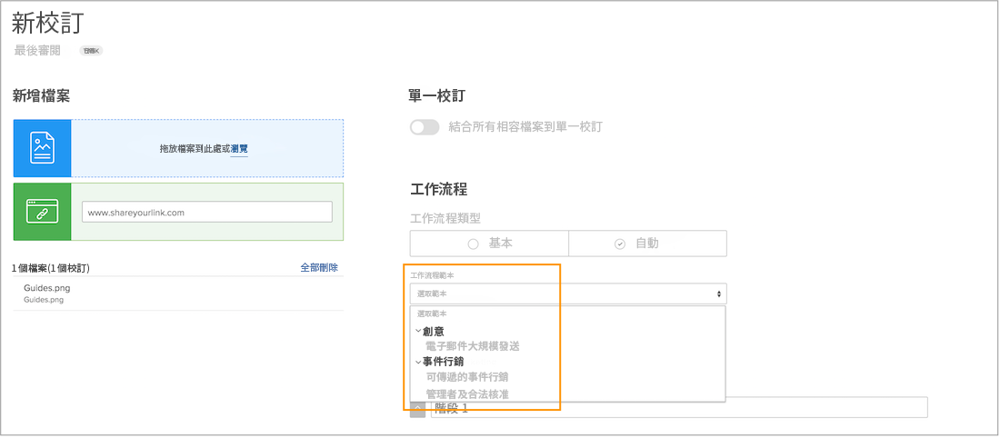
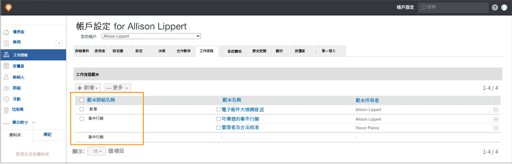

# 建立範本群組，以組織自動化工作流程範本

開始建立自動化工作流模板之前， [!DNL Workfront] 建議您建立範本群組，以協助組織範本。 如果您有多個團隊或部門使用校對功能，則群組（可將它們視為存放各種範本的貯體）會很有幫助，因為這些群組有助於讓範本保持井然有序，讓指派審核和核准程式的人員知道要使用哪些範本。

如果您不確定要如何將範本組織到群組中，可以稍後新增群組資訊。 不過，在建立範本時，最簡單的做法是指派範本群組。

您不僅會在校樣設定中看到這些群組，而且在套用校樣工作流程時選取範本時也會看到這些群組。 範本清單中的粗體字詞是群組。

範本群組為選用。 如果您的組織只有幾個範本，則您可能不需要將它們分組。

**若要建立範本群組**

1. 選擇 **[!UICONTROL 校對]** 從 **[!UICONTROL 主菜單]** in [!DNL Workfront].
1. 選擇 **[!UICONTROL 帳戶設定]** 打樣設定區域開啟後。
1. 前往 **[!UICONTROL 工作流程]** 的上界。
1. 選擇 **[!UICONTROL 新範本群組]** 從 **[!UICONTROL 新增]** 按鈕。
1. 為群組命名。
1. 按一下欄位外部以儲存。

新群組現在會顯示在清單中。

## 刪除群組

如果刪除包含範本的群組，則會保留這些範本，並移至一般「[!UICONTROL 工作流程範本]」組。 您可以視需要將範本移至其他群組。

<!--
Learn More Icon
Create and manage Automated Workflow templates
-->
