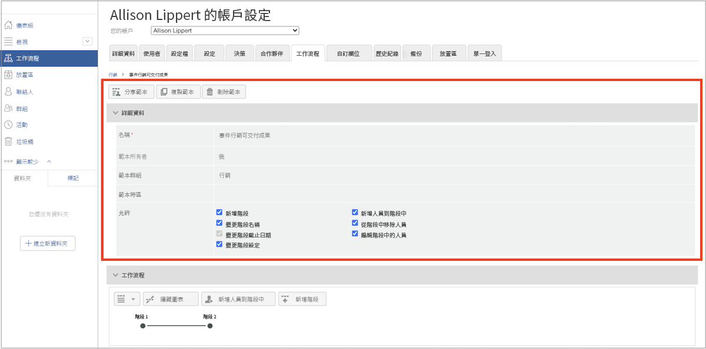
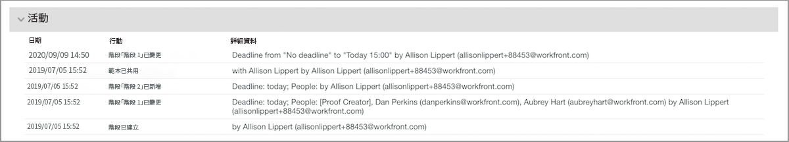

# 編輯自動化工作流程範本

隨著校訂檢閱和核准流程的完善或組織變更的進行，自動化工作流程範本應該更新，以反映您團隊使用Workfront的當前操作。

讓範本保持最新可確保稽核和核准流程的一致性，並且因為不必持續調整工作流程，可節省上傳校樣的時間。

1. 選取 **[!UICONTROL 校訂]** 從 **[!UICONTROL 主要功能表]** 在 [!DNL Workfront].
1. 從那裡，選擇 **[!UICONTROL 工作流程]** 在左側面板選單中。
1. 按一下範本名稱最右邊的3點選單，然後選取 **[!UICONTROL 檢視範本詳細資料]**.

共用、複製和刪除範本的選項跨過每個範本的範本詳細資訊視窗的頂端。 刪除範本不會影響已套用該範本的進行中校訂，但表示範本無法再使用。

<!--
Lean More URLs
-->

按一下箭頭以展開 [!UICONTROL 詳細資料] 區段來變更範本名稱或範本時區等。

## 變更階段和收件者

中可能需要變更 [!UICONTROL 工作流程] 當簡化的程式意味著較早的截止日期，或當有人加入團隊並將稽核校樣時。

自動化工作流程的每個階段都有自己的區段，允許獨立修改截止日期、隱私權、校樣收件者及其他資訊。

本影片會簡短示範您可在下列專案中所做的一些變更： [!UICONTROL 工作流程] 區域。 請參閱此影片底下的專案符號清單，其中會檢閱這些設定。 此影片中沒有音訊。

>[!VIDEO](https://video.tv.adobe.com/v/335131/?quality=12&learn=on)

作為檢閱，以下是您可以在下列專案中所做的校樣範本變更 [!UICONTROL 工作流程] 區段：

* 按一下 [!UICONTROL 階段名稱] 欄位或 [!UICONTROL 期限] 欄位以更新該資訊。
* 選取「 」旁的箭頭 [!UICONTROL 期限] 若要鎖定舞台，請決定舞台何時啟動，或只需要一個決定。
* 在收件者清單中，按一下 [!UICONTROL 角色] 或 [!UICONTROL 電子郵件警示] 欄位以選取其他選項。
* 前往收件者名稱最右邊的3點選單，從清單中刪除收件者，讓他們成為該工作流程階段的主要決策者，或編輯校樣角色和電子郵件警報資訊。
* 您有兩個選項可以將收件者新增至清單。 一旦您開啟 [!UICONTROL 將人員新增至階段] 視窗中，按一下要將它們新增至哪個階段。 然後在收件者清單中輸入其名稱或電子郵件地址，並指派校樣角色和電子郵件警報。 按一下 [!UICONTROL 新增人員] 按鈕。
   1. 在每個舞台區段的右上角，前往 [!UICONTROL 更多] 功能表並選取 [!UICONTROL 將人員新增至階段].
   1. 在頂端 [!UICONTROL 工作流程] 區域，選取 [!UICONTROL 將人員新增至階段].

## 範本共用

此 [!UICONTROL 共用對象] 區域顯示可以使用範本的校樣使用者。 按一下名稱最右邊的3點選單，然後選取「 」，移除不再需要使用該範本的人 [!UICONTROL 移除].

![[!UICONTROL 共用對象] 清單](assets/proof-system-setups-edit-template-shared-with.png)

不過，您無法從此區段新增人員至共用清單。 要執行此操作，請返回範本詳細資訊視窗的頂端並按一下 [!UICONTROL 共用範本] 按鈕。

## 活動區段

[!DNL Workfront] 保留對範本進行變更時的稽核歷史記錄。 您可以檢視變更的日期、變更對象，以及有關變更內容的簡短資訊。

此區段不會記錄有關範本何時用於校訂的資訊。

