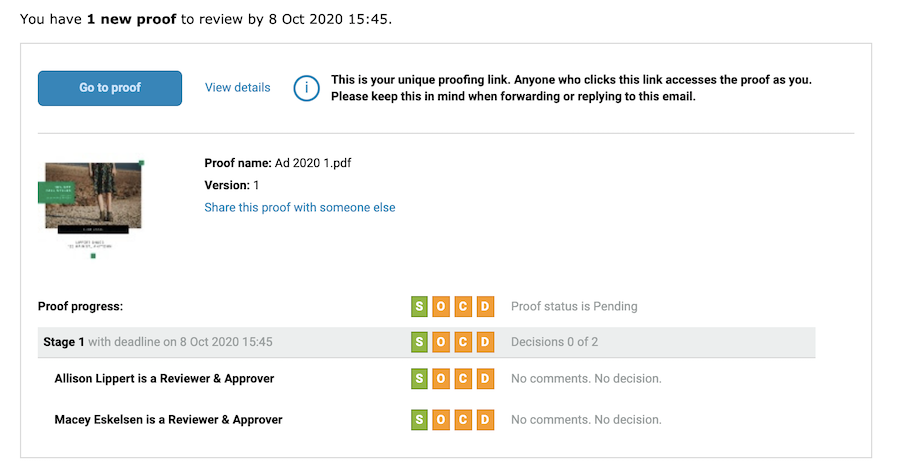

# 了解電子郵件警報和校訂通知

電子郵件警報與校訂通知電子郵件不同。 若有新的校訂內容指派給您審閱、校訂未如期提交，或是有新版校訂需要您審閱時，您會收到校訂通知電子郵件。

如果您在上傳校訂時關閉通知選項，則沒有人會收到來自 [!DNL Workfront] 說明有新校訂內容待審閱的通訊。

電子郵件警報是依據每一位審閱者/核准者進行設定，最常見是在上傳校訂時設定。 您可以指派預設的電子郵件警報類型給校訂收件人，這樣一來，便不需要每次上傳校訂時再設定。 請與您的系統管理員討論如何設定這些預設值。

即使電子郵件警報設為[!UICONTROL 停用]，校訂收件者仍會因為新校訂或新版本而收到通知。

## 最佳實務

| 最佳實務 | 原因說明 |
|---|---|
| 在 Workfront 設定中停用「當有人在校訂中留下註解時，Workfront 將傳送電子郵件」設定。 | 啟用這項設定後 (預設)，針對校訂上的每一個註解，使用者可能收到多個電子郵件通知，一則來自校訂功能，另一則來自 Workfront 本身。 這些重複的通知會導致電子郵件通知中斷和混亂，而且通知會塞滿收件匣，最終可能導致使用者忽略所收到的校訂通知。 而這樣反而會導致他們錯過截止期限。    備註：這項設定位在 Workfront 主選單 >「設定」>「電子郵件」>「審閱和核准」。 |

