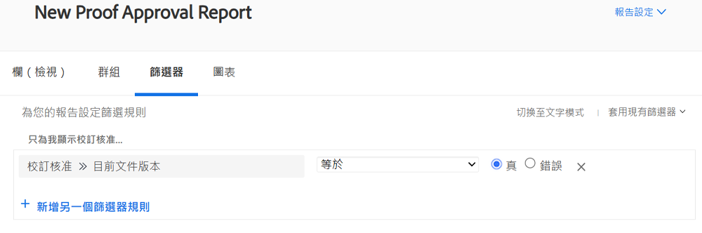
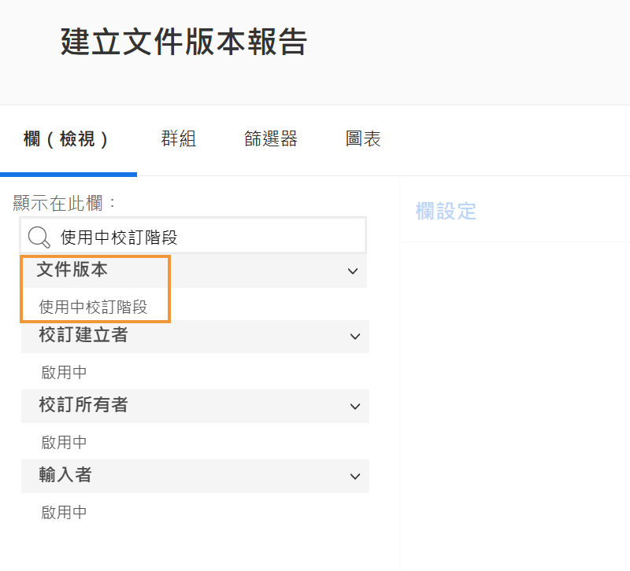
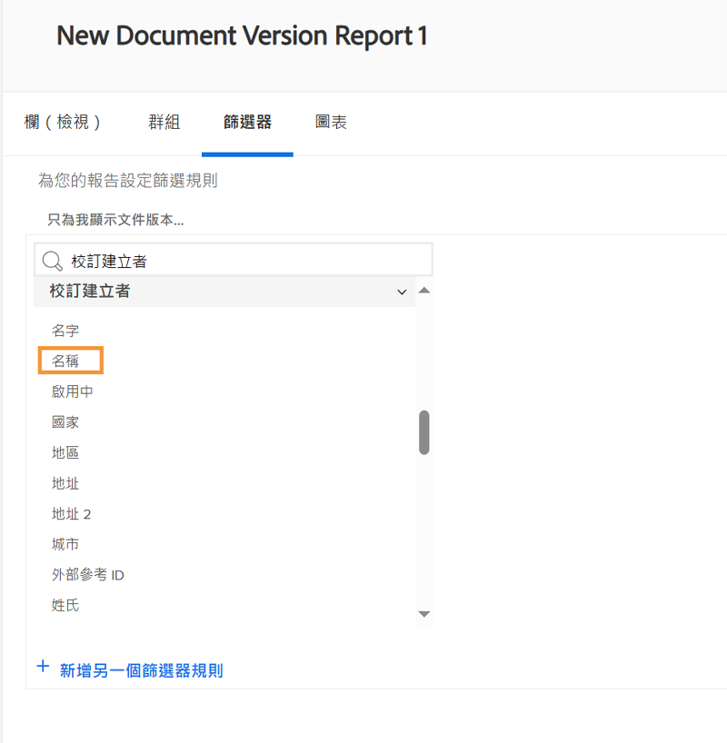

# 校樣報告

[!DNL Workfront]的數位校訂功能可讓您在一個地方管理專案和相關稽核工作流程 —  [!DNL Workfront]. 對於使用顯示檢閱和核准資訊的報告型別、欄位來源和欄位名稱完成的校訂工作，獲得寶貴的見解。

我們建議您與您的 [!DNL Workfront] 顧問，建立符合您組織需求的報告。 部分報表需先熟悉 [!DNL Workfront]的文字模式報告。

從這些基本的標準報告開始，幫助您的團隊管理校樣稽核和核准流程 [!DNL Workfront].

## [!UICONTROL 校訂核准]

此報告型別可幫助您追蹤未完成的校訂核准，以確保遵守截止日期。

![選取 [!UICONTROL 校訂核准] 從 [!UICONTROL 新報告] 下拉式功能表](assets/proof-system-setups-proof-approval-report.png)

檢視和篩選選項包括 [!UICONTROL 決定日期]， [!UICONTROL 校訂核准]， [!UICONTROL 核准者階段]， [!UICONTROL 工作流程範本]、和 [!UICONTROL 請求者資訊]. 使用文字模式報告，您可以建立依檔名稱組織清單的分組。 另請參閱 [瞭解群組的基本文字模式](https://experienceleague.adobe.com/docs/workfront-learn/tutorials-workfront/reporting/intermediate-reporting/basic-text-mode-for-groupings.html?lang=en).

撰寫校訂核准報告時，請確定您獲得與最新版校訂相關的資訊。 [!DNL Workfront] 建議將此欄位來源和欄位名稱納入篩選中：

**[!UICONTROL 校訂核准]>>[!UICONTROL 為目前檔案版本]**

當您報告具有多個版本的校訂時，這會很有用，因此報告僅列出需要核准的每個校訂的最新版本。 這會篩選掉您不再需要處理的舊版。

## [!UICONTROL 文件版本]

此報告型別可讓您在中管理和追蹤版本 [!DNL Workfront].

![選取 [!UICONTROL 檔案版本] 從 [!UICONTROL 新報告] 下拉式功能表](assets/proof-system-setups-document-version-report.png)

檢視選項包含下列專案的資訊： [!UICONTROL 檔案版本]， [!UICONTROL 檔案]， [!UICONTROL 輸入者]， [!UICONTROL 校訂核准狀態]， [!UICONTROL 校訂建立者]、和 [!UICONTROL 檔案提供者].

分組可由以下人員完成： [!UICONTROL 檔案版本]， [!UICONTROL 輸入者]， [!UICONTROL 校訂核准狀態]或校訂所有者資訊。

篩選器包括 [!UICONTROL 檔案版本]， [!UICONTROL 存取層級]， [!UICONTROL 檔案]， [!UICONTROL 輸入者]， [!UICONTROL 校訂核准狀態]， [!UICONTROL 校訂建立者]，以及檔案提供者資訊。

您可以在檢視中透過此欄顯示報表上每個檔案目前作用中之校訂階段的名稱：

**[!UICONTROL 檔案版本] >> [!UICONTROL 作用中校訂階段]**

如果目前沒有任何階段處於作用中狀態，則欄為空白。

此欄位來源>>欄位名稱也可作為報表中的篩選條件。

使用 [!UICONTROL 校訂建立者] 用於報告建立校樣之使用者相關資訊的欄位來源。 選擇 [!UICONTROL 名稱] 在檢視中顯示校訂建立者名稱的欄位來源。

**[!UICONTROL 校訂建立者] >> [!UICONTROL 名稱]**

此欄位來源>>欄位名稱下拉式選單也可用作篩選條件。

<!--
Learn More Icon
Learn how to create reports in [!DNL Workfront] with the Report Creation class.
Access to proofing functionality
-->
