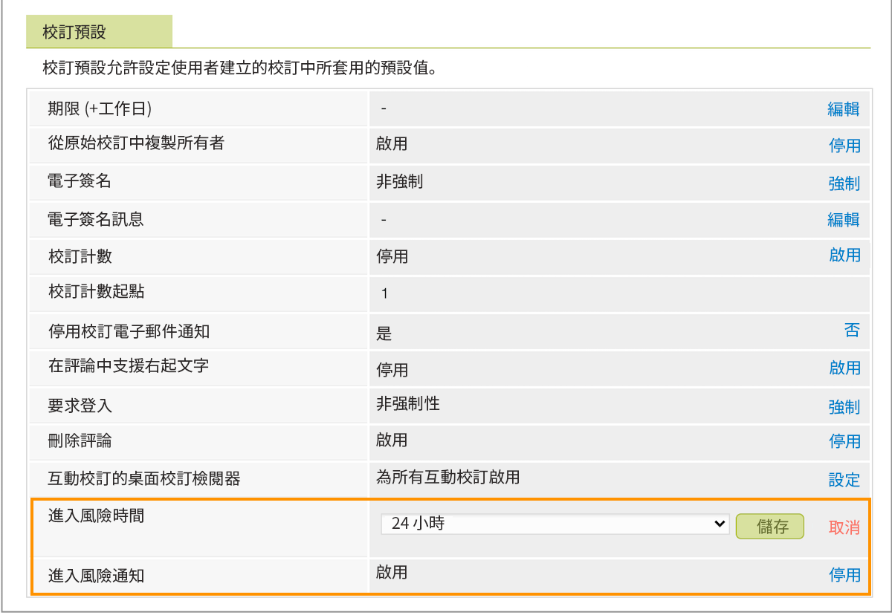

# 在風險證明設定中設定預設值

您將要為風險通知建立設定， [!DNL Workfront] 寄出。 這些是對即將到來的證明截止日期的溫和提醒，提醒證明所有者和批准者，他們尚未做出決定。

風險通知預設為開啟，在證明截止時間前24小時，證據被視為「風險」。 [!DNL Workfront] 建議將此通知維持為24小時時間範圍開啟。 不過，如果貴組織的證明週轉時間是數小時而非數天，您可能會想要將此時間縮短至數小時。

1. 選擇 **[!UICONTROL 校對]** 從 [!DNL Workfront’s] [!UICONTROL 主菜單].
1. 選擇 **[!UICONTROL 帳戶設定]** 的下一頁。
1. 選取 **[!UICONTROL 設定]** 標籤。
1. 前往 [!UICONTROL 校樣預設值] 區段。
1. 在 [!UICONTROL 風險時間] 欄位，選擇 **[!UICONTROL 設定]**. 然後選擇應傳送通知的校樣截止時間之前的小時數。
1. 選擇 **[!UICONTROL 儲存]** 的URL。
1. 一定要說 [!UICONTROL 已啟用] 在 [!UICONTROL 風險通知] 欄位。 否則，按一下連結以開啟設定。

## 該你了

1. 登入Workfront並導覽至「設定」區域。 在「檢閱與核准」區段中，選取指定校樣收件者和非收件者的設定。
1. 現在，請使用Workfront的主功能表來前往校樣設定（選取校樣）。 將國家、語言和時區設定為所有證明和校樣使用者的預設值。
1. 如有需要，請在校樣設定區域的「設定」標籤中調整「風險」通知時間。 使用校樣與團隊討論，決定最適合他們的方案。

<!--
Lean More URLs
-->
